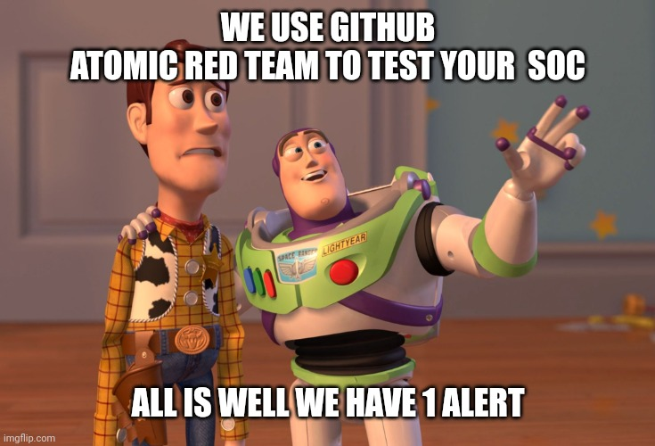

# Welcome to my sigma redcannary cover project

## Purpose

Knowing which rule should trigger when running a [redcannary test](https://github.com/redcanaryco/atomic-red-team)

Caution: a test can generate a lot of noise...

     

[hidden index ;)](./index2.md)

## Tests

### T1036.003
[Masquerading - cscript.exe running as notepad.exe](tests/3a2a578b-0a01-46e4-92e3-62e2859b42f0.md) ['windows'] (sigma rule :heavy_check_mark:)

[Masquerading as Windows LSASS process](tests/5ba5a3d1-cf3c-4499-968a-a93155d1f717.md) ['windows'] (sigma rule :heavy_check_mark:)

[Masquerading - wscript.exe running as svchost.exe](tests/24136435-c91a-4ede-9da1-8b284a1c1a23.md) ['windows'] (sigma rule :heavy_check_mark:)

[Masquerading - windows exe running as different windows exe](tests/c3d24a39-2bfe-4c6a-b064-90cd73896cb0.md) ['windows'] (sigma rule :heavy_check_mark:)

[Masquerading - non-windows exe running as windows exe](tests/bc15c13f-d121-4b1f-8c7d-28d95854d086.md) ['windows'] (sigma rule :heavy_check_mark:)

[Malicious process Masquerading as LSM.exe](tests/83810c46-f45e-4485-9ab6-8ed0e9e6ed7f.md) ['windows'] (sigma rule :heavy_check_mark:)

[File Extension Masquerading](tests/c7fa0c3b-b57f-4cba-9118-863bf4e653fc.md) ['windows'] (sigma rule :heavy_check_mark:)

[Masquerading as Linux crond process.](tests/a315bfff-7a98-403b-b442-2ea1b255e556.md) ['linux'] (sigma rule :x:)

[Masquerading - powershell.exe running as taskhostw.exe](tests/ac9d0fc3-8aa8-4ab5-b11f-682cd63b40aa.md) ['windows'] (sigma rule :heavy_check_mark:)

### T1140
[Base64 decoding with Perl](tests/6604d964-b9f6-4d4b-8ce8-499829a14d0a.md) ['linux', 'macos'] (sigma rule :x:)

[Hex decoding with shell utilities](tests/005943f9-8dd5-4349-8b46-0313c0a9f973.md) ['linux', 'macos'] (sigma rule :x:)

[Deobfuscate/Decode Files Or Information](tests/dc6fe391-69e6-4506-bd06-ea5eeb4082f8.md) ['windows'] (sigma rule :heavy_check_mark:)

[Base64 decoding with shell utilities](tests/b4f6a567-a27a-41e5-b8ef-ac4b4008bb7e.md) ['linux', 'macos'] (sigma rule :x:)

[Base64 decoding with Python](tests/356dc0e8-684f-4428-bb94-9313998ad608.md) ['linux', 'macos'] (sigma rule :x:)

[Certutil Rename and Decode](tests/71abc534-3c05-4d0c-80f7-cbe93cb2aa94.md) ['windows'] (sigma rule :heavy_check_mark:)

### T1555.001
[Keychain](tests/1864fdec-ff86-4452-8c30-f12507582a93.md) ['macos'] (sigma rule :x:)

### T1039
[Copy a sensitive File over Administive share with Powershell](tests/7762e120-5879-44ff-97f8-008b401b9a98.md) ['windows'] (sigma rule :heavy_check_mark:)

[Copy a sensitive File over Administive share with copy](tests/6ed67921-1774-44ba-bac6-adb51ed60660.md) ['windows'] (sigma rule :heavy_check_mark:)

### T1489
[Windows - Stop service using net.exe](tests/41274289-ec9c-4213-bea4-e43c4aa57954.md) ['windows'] (sigma rule :heavy_check_mark:)

[Windows - Stop service using Service Controller](tests/21dfb440-830d-4c86-a3e5-2a491d5a8d04.md) ['windows'] (sigma rule :heavy_check_mark:)

[Windows - Stop service by killing process](tests/f3191b84-c38b-400b-867e-3a217a27795f.md) ['windows'] (sigma rule :heavy_check_mark:)

### T1564.006
[Create and start Hyper-V virtual machine](tests/fb8d4d7e-f5a4-481c-8867-febf13f8b6d3.md) ['windows'] (sigma rule :heavy_check_mark:)

[Register Portable Virtualbox](tests/c59f246a-34f8-4e4d-9276-c295ef9ba0dd.md) ['windows'] (sigma rule :heavy_check_mark:)

[Create and start VirtualBox virtual machine](tests/88b81702-a1c0-49a9-95b2-2dd53d755767.md) ['windows'] (sigma rule :heavy_check_mark:)

### T1201
[Examine domain password policy - Windows](tests/46c2c362-2679-4ef5-aec9-0e958e135be4.md) ['windows'] (sigma rule :heavy_check_mark:)

[Examine local password policy - Windows](tests/4588d243-f24e-4549-b2e3-e627acc089f6.md) ['windows'] (sigma rule :heavy_check_mark:)

[Get-DomainPolicy with PowerView](tests/3177f4da-3d4b-4592-8bdc-aa23d0b2e843.md) ['windows'] (sigma rule :heavy_check_mark:)

[Enumerate Active Directory Password Policy with get-addefaultdomainpasswordpolicy](tests/b2698b33-984c-4a1c-93bb-e4ba72a0babb.md) ['windows'] (sigma rule :heavy_check_mark:)

[Examine password complexity policy - CentOS/RHEL 7.x](tests/78a12e65-efff-4617-bc01-88f17d71315d.md) ['linux'] (sigma rule :x:)

[Examine password policy - macOS](tests/4b7fa042-9482-45e1-b348-4b756b2a0742.md) ['macos'] (sigma rule :x:)

[Examine password complexity policy - CentOS/RHEL 6.x](tests/6ce12552-0adb-4f56-89ff-95ce268f6358.md) ['linux'] (sigma rule :x:)

[Examine password expiration policy - All Linux](tests/7c86c55c-70fa-4a05-83c9-3aa19b145d1a.md) ['linux'] (sigma rule :x:)

[Examine password complexity policy - Ubuntu](tests/085fe567-ac84-47c7-ac4c-2688ce28265b.md) ['linux'] (sigma rule :x:)

### T1558.003
[Extract all accounts in use as SPN using setspn](tests/e6f4affd-d826-4871-9a62-6c9004b8fe06.md) ['windows'] (sigma rule :heavy_check_mark:)

[Request for service tickets](tests/3f987809-3681-43c8-bcd8-b3ff3a28533a.md) ['windows'] (sigma rule :heavy_check_mark:)

[Request A Single Ticket via PowerShell](tests/988539bc-2ed7-4e62-aec6-7c5cf6680863.md) ['windows'] (sigma rule :heavy_check_mark:)

[WinPwn - Kerberoasting](tests/78d10e20-c874-45f2-a9df-6fea0120ec27.md) ['windows'] (sigma rule :heavy_check_mark:)

[WinPwn - PowerSharpPack - Kerberoasting Using Rubeus](tests/29094950-2c96-4cbd-b5e4-f7c65079678f.md) ['windows'] (sigma rule :heavy_check_mark:)

[Rubeus kerberoast](tests/14625569-6def-4497-99ac-8e7817105b55.md) ['windows'] (sigma rule :heavy_check_mark:)

[Request All Tickets via PowerShell](tests/902f4ed2-1aba-4133-90f2-cff6d299d6da.md) ['windows'] (sigma rule :heavy_check_mark:)

### T1529
[Restart System - Windows](tests/f4648f0d-bf78-483c-bafc-3ec99cd1c302.md) ['windows'] (sigma rule :heavy_check_mark:)

[Logoff System - Windows](tests/3d8c25b5-7ff5-4c9d-b21f-85ebd06654a4.md) ['windows'] (sigma rule :x:)

[Shutdown System via `poweroff` - Linux](tests/73a90cd2-48a2-4ac5-8594-2af35fa909fa.md) ['linux'] (sigma rule :x:)

[Restart System via `reboot` - macOS/Linux](tests/47d0b042-a918-40ab-8cf9-150ffe919027.md) ['macos', 'linux'] (sigma rule :x:)

[Shutdown System - Windows](tests/ad254fa8-45c0-403b-8c77-e00b3d3e7a64.md) ['windows'] (sigma rule :heavy_check_mark:)

[Reboot System via `halt` - Linux](tests/78f92e14-f1e9-4446-b3e9-f1b921f2459e.md) ['linux'] (sigma rule :x:)

[Reboot System via `poweroff` - Linux](tests/61303105-ff60-427b-999e-efb90b314e41.md) ['linux'] (sigma rule :x:)

[Shutdown System via `halt` - Linux](tests/918f70ab-e1ef-49ff-bc57-b27021df84dd.md) ['linux'] (sigma rule :x:)

[Shutdown System via `shutdown` - macOS/Linux](tests/4963a81e-a3ad-4f02-adda-812343b351de.md) ['macos', 'linux'] (sigma rule :x:)

[Restart System via `shutdown` - macOS/Linux](tests/6326dbc4-444b-4c04-88f4-27e94d0327cb.md) ['macos', 'linux'] (sigma rule :x:)

### T1555
[WinPwn - Loot local Credentials - Decrypt Teamviewer Passwords](tests/db965264-3117-4bad-b7b7-2523b7856b92.md) ['windows'] (sigma rule :heavy_check_mark:)

[Dump credentials from Windows Credential Manager With PowerShell [web Credentials]](tests/8fd5a296-6772-4766-9991-ff4e92af7240.md) ['windows'] (sigma rule :heavy_check_mark:)

[Extract Windows Credential Manager via VBA](tests/234f9b7c-b53d-4f32-897b-b880a6c9ea7b.md) ['windows'] (sigma rule :heavy_check_mark:)

[Dump credentials from Windows Credential Manager With PowerShell [windows Credentials]](tests/c89becbe-1758-4e7d-a0f4-97d2188a23e3.md) ['windows'] (sigma rule :heavy_check_mark:)

[Enumerate credentials from Windows Credential Manager using vaultcmd.exe [Windows Credentials]](tests/36753ded-e5c4-4eb5-bc3c-e8fba236878d.md) ['windows'] (sigma rule :heavy_check_mark:)

[WinPwn - Loot local Credentials - Wifi Credentials](tests/afe369c2-b42e-447f-98a3-fb1f4e2b8552.md) ['windows'] (sigma rule :heavy_check_mark:)

[Enumerate credentials from Windows Credential Manager using vaultcmd.exe [Web Credentials]](tests/bc071188-459f-44d5-901a-f8f2625b2d2e.md) ['windows'] (sigma rule :heavy_check_mark:)

[WinPwn - Loot local Credentials - lazagne](tests/079ee2e9-6f16-47ca-a635-14efcd994118.md) ['windows'] (sigma rule :heavy_check_mark:)

### T1021.002
[Execute command writing output to local Admin Share](tests/d41aaab5-bdfe-431d-a3d5-c29e9136ff46.md) ['windows'] (sigma rule :heavy_check_mark:)

[Copy and Execute File with PsExec](tests/0eb03d41-79e4-4393-8e57-6344856be1cf.md) ['windows'] (sigma rule :heavy_check_mark:)

[Map Admin Share PowerShell](tests/514e9cd7-9207-4882-98b1-c8f791bae3c5.md) ['windows'] (sigma rule :heavy_check_mark:)

[Map admin share](tests/3386975b-367a-4fbb-9d77-4dcf3639ffd3.md) ['windows'] (sigma rule :heavy_check_mark:)

### T1105
[Download a file using wscript](tests/97116a3f-efac-4b26-8336-b9cb18c45188.md) ['windows'] (sigma rule :x:)

[rsync remote file copy (pull)](tests/3180f7d5-52c0-4493-9ea0-e3431a84773f.md) ['linux', 'macos'] (sigma rule :x:)

[whois file download](tests/c99a829f-0bb8-4187-b2c6-d47d1df74cab.md) ['linux', 'macos'] (sigma rule :x:)

[Download a File with Windows Defender MpCmdRun.exe](tests/815bef8b-bf91-4b67-be4c-abe4c2a94ccc.md) ['windows'] (sigma rule :heavy_check_mark:)

[sftp remote file copy (pull)](tests/0139dba1-f391-405e-a4f5-f3989f2c88ef.md) ['linux', 'macos'] (sigma rule :x:)

[Windows - PowerShell Download](tests/42dc4460-9aa6-45d3-b1a6-3955d34e1fe8.md) ['windows'] (sigma rule :heavy_check_mark:)

[File download with finger.exe on Windows](tests/5f507e45-8411-4f99-84e7-e38530c45d01.md) ['windows'] (sigma rule :heavy_check_mark:)

[MAZE Propagation Script](tests/70f4d07c-5c3e-4d53-bb0a-cdf3ada14baf.md) ['windows'] (sigma rule :heavy_check_mark:)

[Curl Upload File](tests/635c9a38-6cbf-47dc-8615-3810bc1167cf.md) ['windows'] (sigma rule :heavy_check_mark:)

[Printer Migration Command-Line Tool UNC share folder into a zip file](tests/49845fc1-7961-4590-a0f0-3dbcf065ae7e.md) ['windows'] (sigma rule :heavy_check_mark:)

[Download a file with IMEWDBLD.exe](tests/1a02df58-09af-4064-a765-0babe1a0d1e2.md) ['windows'] (sigma rule :heavy_check_mark:)

[certutil download (urlcache)](tests/dd3b61dd-7bbc-48cd-ab51-49ad1a776df0.md) ['windows'] (sigma rule :heavy_check_mark:)

[certutil download (verifyctl)](tests/ffd492e3-0455-4518-9fb1-46527c9f241b.md) ['windows'] (sigma rule :heavy_check_mark:)

[File Download via PowerShell](tests/54a4daf1-71df-4383-9ba7-f1a295d8b6d2.md) ['windows'] (sigma rule :heavy_check_mark:)

[scp remote file copy (push)](tests/83a49600-222b-4866-80a0-37736ad29344.md) ['linux', 'macos'] (sigma rule :x:)

[Download a file with Microsoft Connection Manager Auto-Download](tests/d239772b-88e2-4a2e-8473-897503401bcc.md) ['windows'] (sigma rule :heavy_check_mark:)

[certreq download](tests/6fdaae87-c05b-42f8-842e-991a74e8376b.md) ['windows'] (sigma rule :x:)

[svchost writing a file to a UNC path](tests/fa5a2759-41d7-4e13-a19c-e8f28a53566f.md) ['windows'] (sigma rule :heavy_check_mark:)

[Curl Download File](tests/2b080b99-0deb-4d51-af0f-833d37c4ca6a.md) ['windows'] (sigma rule :heavy_check_mark:)

[sftp remote file copy (push)](tests/f564c297-7978-4aa9-b37a-d90477feea4e.md) ['linux', 'macos'] (sigma rule :x:)

[scp remote file copy (pull)](tests/b9d22b9a-9778-4426-abf0-568ea64e9c33.md) ['linux', 'macos'] (sigma rule :x:)

[Lolbas replace.exe use to copy file](tests/54782d65-12f0-47a5-b4c1-b70ee23de6df.md) ['windows'] (sigma rule :heavy_check_mark:)

[rsync remote file copy (push)](tests/0fc6e977-cb12-44f6-b263-2824ba917409.md) ['linux', 'macos'] (sigma rule :x:)

[Linux Download File and Run](tests/bdc373c5-e9cf-4563-8a7b-a9ba720a90f3.md) ['linux'] (sigma rule :x:)

[Lolbas replace.exe use to copy UNC file](tests/ed0335ac-0354-400c-8148-f6151d20035a.md) ['windows'] (sigma rule :heavy_check_mark:)

[OSTAP Worming Activity](tests/2ca61766-b456-4fcf-a35a-1233685e1cad.md) ['windows'] (sigma rule :heavy_check_mark:)

[Windows - BITSAdmin BITS Download](tests/a1921cd3-9a2d-47d5-a891-f1d0f2a7a31b.md) ['windows'] (sigma rule :heavy_check_mark:)

### T1037.004
[rc.local](tests/126f71af-e1c9-405c-94ef-26a47b16c102.md) ['linux'] (sigma rule :x:)

[rc.common](tests/97a48daa-8bca-4bc0-b1a9-c1d163e762de.md) ['macos'] (sigma rule :x:)

[rc.common](tests/c33f3d80-5f04-419b-a13a-854d1cbdbf3a.md) ['linux'] (sigma rule :x:)

### T1218.004
[InstallHelper method call](tests/d43a5bde-ae28-4c55-a850-3f4c80573503.md) ['windows'] (sigma rule :heavy_check_mark:)

[InstallUtil evasive invocation](tests/559e6d06-bb42-4307-bff7-3b95a8254bad.md) ['windows'] (sigma rule :heavy_check_mark:)

[InstallUtil Uninstall method call - '/installtype=notransaction /action=uninstall' variant](tests/06d9deba-f732-48a8-af8e-bdd6e4d98c1d.md) ['windows'] (sigma rule :heavy_check_mark:)

[InstallUtil Uninstall method call - /U variant](tests/34428cfa-8e38-41e5-aff4-9e1f8f3a7b4b.md) ['windows'] (sigma rule :heavy_check_mark:)

[InstallUtil class constructor method call](tests/9b7a7cfc-dd2e-43f5-a885-c0a3c270dd93.md) ['windows'] (sigma rule :heavy_check_mark:)

[CheckIfInstallable method call](tests/ffd9c807-d402-47d2-879d-f915cf2a3a94.md) ['windows'] (sigma rule :heavy_check_mark:)

[InstallUtil Install method call](tests/9f9968a6-601a-46ca-b7b7-6d4fe0f98f0b.md) ['windows'] (sigma rule :heavy_check_mark:)

[InstallUtil HelpText method call](tests/5a683850-1145-4326-a0e5-e91ced3c6022.md) ['windows'] (sigma rule :heavy_check_mark:)

### T1218.005
[Invoke HTML Application - Jscript Engine Simulating Double Click](tests/58a193ec-131b-404e-b1ca-b35cf0b18c33.md) ['windows'] (sigma rule :heavy_check_mark:)

[Invoke HTML Application - Jscript Engine over Local UNC Simulating Lateral Movement](tests/007e5672-2088-4853-a562-7490ddc19447.md) ['windows'] (sigma rule :heavy_check_mark:)

[Mshta Executes Remote HTML Application (HTA)](tests/c4b97eeb-5249-4455-a607-59f95485cb45.md) ['windows'] (sigma rule :heavy_check_mark:)

[Invoke HTML Application - JScript Engine with Rundll32 and Inline Protocol Handler](tests/e7e3a525-7612-4d68-a5d3-c4649181b8af.md) ['windows'] (sigma rule :heavy_check_mark:)

[Mshta used to Execute PowerShell](tests/8707a805-2b76-4f32-b1c0-14e558205772.md) ['windows'] (sigma rule :heavy_check_mark:)

[Invoke HTML Application - JScript Engine with Inline Protocol Handler](tests/d3eaaf6a-cdb1-44a9-9ede-b6c337d0d840.md) ['windows'] (sigma rule :heavy_check_mark:)

[Invoke HTML Application - Simulate Lateral Movement over UNC Path](tests/b8a8bdb2-7eae-490d-8251-d5e0295b2362.md) ['windows'] (sigma rule :heavy_check_mark:)

[Mshta executes JavaScript Scheme Fetch Remote Payload With GetObject](tests/1483fab9-4f52-4217-a9ce-daa9d7747cae.md) ['windows'] (sigma rule :heavy_check_mark:)

[Invoke HTML Application - Direct download from URI](tests/39ceed55-f653-48ac-bd19-aceceaf525db.md) ['windows'] (sigma rule :heavy_check_mark:)

[Mshta executes VBScript to execute malicious command](tests/906865c3-e05f-4acc-85c4-fbc185455095.md) ['windows'] (sigma rule :heavy_check_mark:)

### T1486
[Encrypt files using gpg (Linux)](tests/7b8ce084-3922-4618-8d22-95f996173765.md) ['linux'] (sigma rule :x:)

[Encrypt files using openssl (Linux)](tests/142752dc-ca71-443b-9359-cf6f497315f1.md) ['linux'] (sigma rule :x:)

[Encrypt files using ccrypt (Linux)](tests/08cbf59f-85da-4369-a5f4-049cffd7709f.md) ['linux'] (sigma rule :x:)

[Encrypt files using 7z (Linux)](tests/53e6735a-4727-44cc-b35b-237682a151ad.md) ['linux'] (sigma rule :x:)

[PureLocker Ransom Note](tests/649349c7-9abf-493b-a7a2-b1aa4d141528.md) ['windows'] (sigma rule :heavy_check_mark:)

### T1006
[Read volume boot sector via DOS device path (PowerShell)](tests/88f6327e-51ec-4bbf-b2e8-3fea534eab8b.md) ['windows'] (sigma rule :heavy_check_mark:)

### T1490
[Windows - Delete Volume Shadow Copies via WMI](tests/6a3ff8dd-f49c-4272-a658-11c2fe58bd88.md) ['windows'] (sigma rule :heavy_check_mark:)

[Windows - Delete Volume Shadow Copies](tests/43819286-91a9-4369-90ed-d31fb4da2c01.md) ['windows'] (sigma rule :heavy_check_mark:)

[Windows - Delete Backup Files](tests/6b1dbaf6-cc8a-4ea6-891f-6058569653bf.md) ['windows'] (sigma rule :heavy_check_mark:)

[Windows - Disable Windows Recovery Console Repair](tests/cf21060a-80b3-4238-a595-22525de4ab81.md) ['windows'] (sigma rule :heavy_check_mark:)

[Disable System Restore Through Registry](tests/66e647d1-8741-4e43-b7c1-334760c2047f.md) ['windows'] (sigma rule :heavy_check_mark:)

[Windows - wbadmin Delete Windows Backup Catalog](tests/263ba6cb-ea2b-41c9-9d4e-b652dadd002c.md) ['windows'] (sigma rule :heavy_check_mark:)

[Windows - Disable the SR scheduled task](tests/1c68c68d-83a4-4981-974e-8993055fa034.md) ['windows'] (sigma rule :heavy_check_mark:)

[Windows - wbadmin Delete systemstatebackup](tests/584331dd-75bc-4c02-9e0b-17f5fd81c748.md) ['windows'] (sigma rule :heavy_check_mark:)

[Windows - Delete Volume Shadow Copies via WMI with PowerShell](tests/39a295ca-7059-4a88-86f6-09556c1211e7.md) ['windows'] (sigma rule :heavy_check_mark:)

### T1530
[Azure - Enumerate Azure Blobs with MicroBurst](tests/3dab4bcc-667f-4459-aea7-4162dd2d6590.md) ['iaas:azure'] (sigma rule :x:)

[AWS - Scan for Anonymous Access to S3](tests/979356b9-b588-4e49-bba4-c35517c484f5.md) ['iaas:aws'] (sigma rule :x:)

[Azure - Scan for Anonymous Access to Azure Storage (Powershell)](tests/146af1f1-b74e-4aa7-9895-505eb559b4b0.md) ['iaas:azure'] (sigma rule :x:)

### T1098
[Azure - adding service principal to Azure role in subscription](tests/c8f4bc29-a151-48da-b3be-4680af56f404.md) ['iaas:azure'] (sigma rule :x:)

[Domain Account and Group Manipulate](tests/a55a22e9-a3d3-42ce-bd48-2653adb8f7a9.md) ['windows'] (sigma rule :heavy_check_mark:)

[Azure - adding service principal to Azure AD role](tests/92c40b3f-c406-4d1f-8d2b-c039bf5009e4.md) ['azure-ad'] (sigma rule :x:)

[Azure - adding user to Azure role in subscription](tests/1a94b3fc-b080-450a-b3d8-6d9b57b472ea.md) ['iaas:azure'] (sigma rule :x:)

[AWS - Create a group and add a user to that group](tests/8822c3b0-d9f9-4daf-a043-49f110a31122.md) ['iaas:aws'] (sigma rule :x:)

[Admin Account Manipulate](tests/5598f7cb-cf43-455e-883a-f6008c5d46af.md) ['windows'] (sigma rule :heavy_check_mark:)

[Password Change on Directory Service Restore Mode (DSRM) Account](tests/d5b886d9-d1c7-4b6e-a7b0-460041bf2823.md) ['windows'] (sigma rule :heavy_check_mark:)

[AzureAD - adding permission to application](tests/94ea9cc3-81f9-4111-8dde-3fb54f36af4b.md) ['azure-ad'] (sigma rule :x:)

[Azure - adding user to Azure AD role](tests/0e65ae27-5385-46b4-98ac-607a8ee82261.md) ['azure-ad'] (sigma rule :x:)

### T1562.001
[LockBit Black - Use Registry Editor to turn on automatic logon -cmd](tests/9719d0e1-4fe0-4b2e-9a72-7ad3ee8ddc70.md) ['windows'] (sigma rule :x:)

[Disable macOS Gatekeeper](tests/2a821573-fb3f-4e71-92c3-daac7432f053.md) ['macos'] (sigma rule :x:)

[Tamper with Windows Defender Evade Scanning -Process](tests/a123ce6a-3916-45d6-ba9c-7d4081315c27.md) ['windows'] (sigma rule :heavy_check_mark:)

[office-365-Disable-AntiPhishRule](tests/b9bbae2c-2ba6-4cf3-b452-8e8f908696f3.md) ['office-365'] (sigma rule :x:)

[AMSI Bypass - Remove AMSI Provider Reg Key](tests/13f09b91-c953-438e-845b-b585e51cac9b.md) ['windows'] (sigma rule :heavy_check_mark:)

[WinPwn - Kill the event log services for stealth](tests/7869d7a3-3a30-4d2c-a5d2-f1cd9c34ce66.md) ['windows'] (sigma rule :heavy_check_mark:)

[Uninstall Crowdstrike Falcon on Windows](tests/b32b1ccf-f7c1-49bc-9ddd-7d7466a7b297.md) ['windows'] (sigma rule :heavy_check_mark:)

[Disable LittleSnitch](tests/62155dd8-bb3d-4f32-b31c-6532ff3ac6a3.md) ['macos'] (sigma rule :x:)

[Disable Carbon Black Response](tests/8fba7766-2d11-4b4a-979a-1e3d9cc9a88c.md) ['macos'] (sigma rule :x:)

[Disable Microsoft Office Security Features](tests/6f5fb61b-4e56-4a3d-a8c3-82e13686c6d7.md) ['windows'] (sigma rule :heavy_check_mark:)

[Tamper with Windows Defender ATP PowerShell](tests/6b8df440-51ec-4d53-bf83-899591c9b5d7.md) ['windows'] (sigma rule :heavy_check_mark:)

[Tamper with Windows Defender Evade Scanning -Extension](tests/315f4be6-2240-4552-b3e1-d1047f5eecea.md) ['windows'] (sigma rule :heavy_check_mark:)

[Tamper with Windows Defender Command Prompt](tests/aa875ed4-8935-47e2-b2c5-6ec00ab220d2.md) ['windows'] (sigma rule :heavy_check_mark:)

[Disable Windows Defender with DISM](tests/871438ac-7d6e-432a-b27d-3e7db69faf58.md) ['windows'] (sigma rule :heavy_check_mark:)

[Stop and Remove Arbitrary Security Windows Service](tests/ae753dda-0f15-4af6-a168-b9ba16143143.md) ['windows'] (sigma rule :heavy_check_mark:)

[Lockbit Black - Use Registry Editor to turn on automatic logon -Powershell](tests/5e27f36d-5132-4537-b43b-413b0d5eec9a.md) ['windows'] (sigma rule :x:)

[Disable Defender Using NirSoft AdvancedRun](tests/81ce22fd-9612-4154-918e-8a1f285d214d.md) ['windows'] (sigma rule :heavy_check_mark:)

[Tamper with Windows Defender ATP using Aliases - PowerShell](tests/c531aa6e-9c97-4b29-afee-9b7be6fc8a64.md) ['windows'] (sigma rule :heavy_check_mark:)

[Disable syslog](tests/4ce786f8-e601-44b5-bfae-9ebb15a7d1c8.md) ['linux'] (sigma rule :x:)

[Stop and unload Crowdstrike Falcon on macOS](tests/b3e7510c-2d4c-4249-a33f-591a2bc83eef.md) ['macos'] (sigma rule :x:)

[Stop Crowdstrike Falcon on Linux](tests/828a1278-81cc-4802-96ab-188bf29ca77d.md) ['linux'] (sigma rule :x:)

[Tamper with Windows Defender Registry](tests/1b3e0146-a1e5-4c5c-89fb-1bb2ffe8fc45.md) ['windows'] (sigma rule :heavy_check_mark:)

[Remove Windows Defender Definition Files](tests/3d47daaa-2f56-43e0-94cc-caf5d8d52a68.md) ['windows'] (sigma rule :heavy_check_mark:)

[Unload Sysmon Filter Driver](tests/811b3e76-c41b-430c-ac0d-e2380bfaa164.md) ['windows'] (sigma rule :heavy_check_mark:)

[Disable Defender with Defender Control](tests/178136d8-2778-4d7a-81f3-d517053a4fd6.md) ['windows'] (sigma rule :heavy_check_mark:)

[Uninstall Sysmon](tests/a316fb2e-5344-470d-91c1-23e15c374edc.md) ['windows'] (sigma rule :heavy_check_mark:)

[Kill antimalware protected processes using Backstab](tests/24a12b91-05a7-4deb-8d7f-035fa98591bc.md) ['windows'] (sigma rule :heavy_check_mark:)

[AMSI Bypass - AMSI InitFailed](tests/695eed40-e949-40e5-b306-b4031e4154bd.md) ['windows'] (sigma rule :heavy_check_mark:)

[Disable OpenDNS Umbrella](tests/07f43b33-1e15-4e99-be70-bc094157c849.md) ['macos'] (sigma rule :x:)

[Disable Arbitrary Security Windows Service](tests/a1230893-56ac-4c81-b644-2108e982f8f5.md) ['windows'] (sigma rule :heavy_check_mark:)

[Disable Cb Response](tests/ae8943f7-0f8d-44de-962d-fbc2e2f03eb8.md) ['linux'] (sigma rule :x:)

[LockBit Black - Disable Privacy Settings Experience Using Registry -cmd](tests/d6d22332-d07d-498f-aea0-6139ecb7850e.md) ['windows'] (sigma rule :x:)

[Disable SELinux](tests/fc225f36-9279-4c39-b3f9-5141ab74f8d8.md) ['linux'] (sigma rule :x:)

[LockBit Black - Disable Privacy Settings Experience Using Registry -Powershell](tests/d8c57eaa-497a-4a08-961e-bd5efd7c9374.md) ['windows'] (sigma rule :x:)

[Tamper with Windows Defender Evade Scanning -Folder](tests/0b19f4ee-de90-4059-88cb-63c800c683ed.md) ['windows'] (sigma rule :heavy_check_mark:)

### T1110.003
[Password Spray Microsoft Online Accounts with MSOLSpray (Azure/O365)](tests/f3a10056-0160-4785-8744-d9bd7c12dc39.md) ['azure-ad'] (sigma rule :x:)

[Password Spray all Domain Users](tests/90bc2e54-6c84-47a5-9439-0a2a92b4b175.md) ['windows'] (sigma rule :heavy_check_mark:)

[Password spray all Active Directory domain users with a single password via LDAP against domain controller (NTLM or Kerberos)](tests/f14d956a-5b6e-4a93-847f-0c415142f07d.md) ['windows'] (sigma rule :heavy_check_mark:)

[Password Spray Invoke-DomainPasswordSpray Light](tests/b15bc9a5-a4f3-4879-9304-ea0011ace63a.md) ['windows'] (sigma rule :heavy_check_mark:)

[Password Spray (DomainPasswordSpray)](tests/263ae743-515f-4786-ac7d-41ef3a0d4b2b.md) ['windows'] (sigma rule :heavy_check_mark:)

[Password spray all Azure AD users with a single password](tests/a8aa2d3e-1c52-4016-bc73-0f8854cfa80a.md) ['azure-ad'] (sigma rule :x:)

[WinPwn - DomainPasswordSpray Attacks](tests/5ccf4bbd-7bf6-43fc-83ac-d9e38aff1d82.md) ['windows'] (sigma rule :heavy_check_mark:)

### T1033
[Find computers where user has session - Stealth mode (PowerView)](tests/29857f27-a36f-4f7e-8084-4557cd6207ca.md) ['windows'] (sigma rule :heavy_check_mark:)

[GetCurrent User with PowerShell Script](tests/1392bd0f-5d5a-429e-81d9-eb9d4d4d5b3b.md) ['windows'] (sigma rule :heavy_check_mark:)

[System Owner/User Discovery](tests/2a9b677d-a230-44f4-ad86-782df1ef108c.md) ['linux', 'macos'] (sigma rule :x:)

[System Owner/User Discovery](tests/4c4959bf-addf-4b4a-be86-8d09cc1857aa.md) ['windows'] (sigma rule :heavy_check_mark:)

[User Discovery With Env Vars PowerShell Script](tests/dcb6cdee-1fb0-4087-8bf8-88cfd136ba51.md) ['windows'] (sigma rule :heavy_check_mark:)

### T1087.002
[Enumerate Active Directory for Unconstrained Delegation](tests/46f8dbe9-22a5-4770-8513-66119c5be63b.md) ['windows'] (sigma rule :heavy_check_mark:)

[Adfind - Enumerate Active Directory Admins](tests/b95fd967-4e62-4109-b48d-265edfd28c3a.md) ['windows'] (sigma rule :heavy_check_mark:)

[Automated AD Recon (ADRecon)](tests/95018438-454a-468c-a0fa-59c800149b59.md) ['windows'] (sigma rule :heavy_check_mark:)

[Adfind -Listing password policy](tests/736b4f53-f400-4c22-855d-1a6b5a551600.md) ['windows'] (sigma rule :heavy_check_mark:)

[Enumerate Active Directory Users with ADSISearcher](tests/02e8be5a-3065-4e54-8cc8-a14d138834d3.md) ['windows'] (sigma rule :heavy_check_mark:)

[WinPwn - generaldomaininfo](tests/ce483c35-c74b-45a7-a670-631d1e69db3d.md) ['windows'] (sigma rule :heavy_check_mark:)

[Enumerate all accounts (Domain)](tests/6fbc9e68-5ad7-444a-bd11-8bf3136c477e.md) ['windows'] (sigma rule :heavy_check_mark:)

[Enumerate all accounts via PowerShell (Domain)](tests/8b8a6449-be98-4f42-afd2-dedddc7453b2.md) ['windows'] (sigma rule :heavy_check_mark:)

[Enumerate logged on users via CMD (Domain)](tests/161dcd85-d014-4f5e-900c-d3eaae82a0f7.md) ['windows'] (sigma rule :heavy_check_mark:)

[Adfind - Enumerate Active Directory Exchange AD Objects](tests/5e2938fb-f919-47b6-8b29-2f6a1f718e99.md) ['windows'] (sigma rule :heavy_check_mark:)

[Adfind - Enumerate Active Directory User Objects](tests/e1ec8d20-509a-4b9a-b820-06c9b2da8eb7.md) ['windows'] (sigma rule :heavy_check_mark:)

[Get-DomainUser with PowerView](tests/93662494-5ed7-4454-a04c-8c8372808ac2.md) ['windows'] (sigma rule :heavy_check_mark:)

[Enumerate Default Domain Admin Details (Domain)](tests/c70ab9fd-19e2-4e02-a83c-9cfa8eaa8fef.md) ['windows'] (sigma rule :heavy_check_mark:)

[Enumerate Linked Policies In ADSISearcher Discovery](tests/7ab0205a-34e4-4a44-9b04-e1541d1a57be.md) ['windows'] (sigma rule :heavy_check_mark:)

[Enumerate Root Domain linked policies Discovery](tests/00c652e2-0750-4ca6-82ff-0204684a6fe4.md) ['windows'] (sigma rule :heavy_check_mark:)

### T1569.002
[Use PsExec to execute a command on a remote host](tests/873106b7-cfed-454b-8680-fa9f6400431c.md) ['windows'] (sigma rule :heavy_check_mark:)

[psexec.py (Impacket)](tests/edbcd8c9-3639-4844-afad-455c91e95a35.md) ['linux'] (sigma rule :x:)

[BlackCat pre-encryption cmds with Lateral Movement](tests/31eb7828-97d7-4067-9c1e-c6feb85edc4b.md) ['windows'] (sigma rule :x:)

[Execute a Command as a Service](tests/2382dee2-a75f-49aa-9378-f52df6ed3fb1.md) ['windows'] (sigma rule :heavy_check_mark:)

### T1112
[Disable Windows Change Password Feature](tests/d4a6da40-618f-454d-9a9e-26af552aaeb0.md) ['windows'] (sigma rule :heavy_check_mark:)

[Disable Windows Registry Tool](tests/ac34b0f7-0f85-4ac0-b93e-3ced2bc69bb8.md) ['windows'] (sigma rule :heavy_check_mark:)

[Hide Windows Clock Group Policy Feature](tests/8023db1e-ad06-4966-934b-b6a0ae52689e.md) ['windows'] (sigma rule :heavy_check_mark:)

[Windows Add Registry Value to Load Service in Safe Mode without Network](tests/1dd59fb3-1cb3-4828-805d-cf80b4c3bbb5.md) ['windows'] (sigma rule :heavy_check_mark:)

[Activate Windows NoSetTaskbar Group Policy Feature](tests/d29b7faf-7355-4036-9ed3-719bd17951ed.md) ['windows'] (sigma rule :heavy_check_mark:)

[Disable Windows LogOff Button](tests/e246578a-c24d-46a7-9237-0213ff86fb0c.md) ['windows'] (sigma rule :heavy_check_mark:)

[Windows HideSCAPower Group Policy Feature](tests/8d85a5d8-702f-436f-bc78-fcd9119496fc.md) ['windows'] (sigma rule :heavy_check_mark:)

[Activate Windows NoDesktop Group Policy Feature](tests/93386d41-525c-4a1b-8235-134a628dee17.md) ['windows'] (sigma rule :heavy_check_mark:)

[Disable Windows Toast Notifications](tests/003f466a-6010-4b15-803a-cbb478a314d7.md) ['windows'] (sigma rule :heavy_check_mark:)

[Modify Registry of Local Machine - cmd](tests/282f929a-6bc5-42b8-bd93-960c3ba35afe.md) ['windows'] (sigma rule :heavy_check_mark:)

[Suppress Win Defender Notifications](tests/c30dada3-7777-4590-b970-dc890b8cf113.md) ['windows'] (sigma rule :x:)

[Windows Add Registry Value to Load Service in Safe Mode with Network](tests/c173c948-65e5-499c-afbe-433722ed5bd4.md) ['windows'] (sigma rule :heavy_check_mark:)

[Add domain to Trusted sites Zone](tests/cf447677-5a4e-4937-a82c-e47d254afd57.md) ['windows'] (sigma rule :heavy_check_mark:)

[Modify registry to store logon credentials](tests/c0413fb5-33e2-40b7-9b6f-60b29f4a7a18.md) ['windows'] (sigma rule :heavy_check_mark:)

[Activate Windows NoTrayContextMenu Group Policy Feature](tests/4d72d4b1-fa7b-4374-b423-0fe326da49d2.md) ['windows'] (sigma rule :heavy_check_mark:)

[Activate Windows NoControlPanel Group Policy Feature](tests/a450e469-ba54-4de1-9deb-9023a6111690.md) ['windows'] (sigma rule :heavy_check_mark:)

[Disable Windows Security Center Notifications](tests/45914594-8df6-4ea9-b3cc-7eb9321a807e.md) ['windows'] (sigma rule :x:)

[Disable Windows CMD application](tests/d2561a6d-72bd-408c-b150-13efe1801c2a.md) ['windows'] (sigma rule :heavy_check_mark:)

[Disable Windows Shutdown Button](tests/6e0d1131-2d7e-4905-8ca5-d6172f05d03d.md) ['windows'] (sigma rule :heavy_check_mark:)

[Change Powershell Execution Policy to Bypass](tests/f3a6cceb-06c9-48e5-8df8-8867a6814245.md) ['windows'] (sigma rule :heavy_check_mark:)

[BlackByte Ransomware Registry Changes - CMD](tests/4f4e2f9f-6209-4fcf-9b15-3b7455706f5b.md) ['windows'] (sigma rule :heavy_check_mark:)

[Windows Powershell Logging Disabled](tests/95b25212-91a7-42ff-9613-124aca6845a8.md) ['windows'] (sigma rule :heavy_check_mark:)

[NetWire RAT Registry Key Creation](tests/65704cd4-6e36-4b90-b6c1-dc29a82c8e56.md) ['windows'] (sigma rule :heavy_check_mark:)

[Activate Windows NoFileMenu Group Policy Feature](tests/5e27bdb4-7fd9-455d-a2b5-4b4b22c9dea4.md) ['windows'] (sigma rule :heavy_check_mark:)

[Allow RDP Remote Assistance Feature](tests/86677d0e-0b5e-4a2b-b302-454175f9aa9e.md) ['windows'] (sigma rule :x:)

[Disable Windows Error Reporting Settings](tests/d2c9e41e-cd86-473d-980d-b6403562e3e1.md) ['windows'] (sigma rule :heavy_check_mark:)

[Javascript in registry](tests/15f44ea9-4571-4837-be9e-802431a7bfae.md) ['windows'] (sigma rule :heavy_check_mark:)

[Activate Windows NoRun Group Policy Feature](tests/d49ff3cc-8168-4123-b5b3-f057d9abbd55.md) ['windows'] (sigma rule :heavy_check_mark:)

[Disable Windows Task Manager application](tests/af254e70-dd0e-4de6-9afe-a994d9ea8b62.md) ['windows'] (sigma rule :heavy_check_mark:)

[Activate Windows NoClose Group Policy Feature](tests/12f50e15-dbc6-478b-a801-a746e8ba1723.md) ['windows'] (sigma rule :heavy_check_mark:)

[Disable Windows Notification Center](tests/c0d6d67f-1f63-42cc-95c0-5fd6b20082ad.md) ['windows'] (sigma rule :heavy_check_mark:)

[Windows HideSCANetwork Group Policy Feature](tests/3e757ce7-eca0-411a-9583-1c33b8508d52.md) ['windows'] (sigma rule :heavy_check_mark:)

[Disable Windows Lock Workstation Feature](tests/3dacb0d2-46ee-4c27-ac1b-f9886bf91a56.md) ['windows'] (sigma rule :heavy_check_mark:)

[Activate Windows NoFind Group Policy Feature](tests/ffbb407e-7f1d-4c95-b22e-548169db1fbd.md) ['windows'] (sigma rule :heavy_check_mark:)

[Windows Modify Show Compress Color And Info Tip Registry](tests/795d3248-0394-4d4d-8e86-4e8df2a2693f.md) ['windows'] (sigma rule :heavy_check_mark:)

[BlackByte Ransomware Registry Changes - Powershell](tests/0b79c06f-c788-44a2-8630-d69051f1123d.md) ['windows'] (sigma rule :heavy_check_mark:)

[Modify Registry of Current User Profile - cmd](tests/1324796b-d0f6-455a-b4ae-21ffee6aa6b9.md) ['windows'] (sigma rule :heavy_check_mark:)

[DisallowRun Execution Of Certain Application](tests/71db768a-5a9c-4047-b5e7-59e01f188e84.md) ['windows'] (sigma rule :x:)

[Windows HideSCAVolume Group Policy Feature](tests/7f037590-b4c6-4f13-b3cc-e424c5ab8ade.md) ['windows'] (sigma rule :heavy_check_mark:)

[Terminal Server Client Connection History Cleared](tests/3448824b-3c35-4a9e-a8f5-f887f68bea21.md) ['windows'] (sigma rule :heavy_check_mark:)

[Activate Windows NoPropertiesMyDocuments Group Policy Feature](tests/20fc9daa-bd48-4325-9aff-81b967a84b1d.md) ['windows'] (sigma rule :heavy_check_mark:)

[Ursnif Malware Registry Key Creation](tests/c375558d-7c25-45e9-bd64-7b23a97c1db0.md) ['windows'] (sigma rule :x:)

[Windows HideSCAHealth Group Policy Feature](tests/a4637291-40b1-4a96-8c82-b28f1d73e54e.md) ['windows'] (sigma rule :heavy_check_mark:)

### T1069.001
[WMIObject Group Discovery](tests/69119e58-96db-4110-ad27-954e48f3bb13.md) ['windows'] (sigma rule :heavy_check_mark:)

[SharpHound3 - LocalAdmin](tests/e03ada14-0980-4107-aff1-7783b2b59bb1.md) ['windows'] (sigma rule :heavy_check_mark:)

[Wmic Group Discovery](tests/7413be50-be8e-430f-ad4d-07bf197884b2.md) ['windows'] (sigma rule :heavy_check_mark:)

[Basic Permission Groups Discovery Windows (Local)](tests/1f454dd6-e134-44df-bebb-67de70fb6cd8.md) ['windows'] (sigma rule :heavy_check_mark:)

[Permission Groups Discovery PowerShell (Local)](tests/a580462d-2c19-4bc7-8b9a-57a41b7d3ba4.md) ['windows'] (sigma rule :heavy_check_mark:)

[Permission Groups Discovery (Local)](tests/952931a4-af0b-4335-bbbe-73c8c5b327ae.md) ['macos', 'linux'] (sigma rule :x:)

### T1053.001
[At - Schedule a job](tests/7266d898-ac82-4ec0-97c7-436075d0d08e.md) ['linux'] (sigma rule :x:)

### T1546.015
[COM Hijacking - InprocServer32](tests/48117158-d7be-441b-bc6a-d9e36e47b52b.md) ['windows'] (sigma rule :heavy_check_mark:)

[COM Hijacking with RunDLL32 (Local Server Switch)](tests/123520cc-e998-471b-a920-bd28e3feafa0.md) ['windows'] (sigma rule :heavy_check_mark:)

[Powershell Execute COM Object](tests/752191b1-7c71-445c-9dbe-21bb031b18eb.md) ['windows'] (sigma rule :heavy_check_mark:)

[COM hijacking via TreatAs](tests/33eacead-f117-4863-8eb0-5c6304fbfaa9.md) ['windows'] (sigma rule :x:)

### T1114.001
[Email Collection with PowerShell Get-Inbox](tests/3f1b5096-0139-4736-9b78-19bcb02bb1cb.md) ['windows'] (sigma rule :heavy_check_mark:)

### T1482
[Windows - Discover domain trusts with dsquery](tests/4700a710-c821-4e17-a3ec-9e4c81d6845f.md) ['windows'] (sigma rule :heavy_check_mark:)

[Get-DomainTrust with PowerView](tests/f974894c-5991-4b19-aaf5-7cc2fe298c5d.md) ['windows'] (sigma rule :heavy_check_mark:)

[Adfind - Enumerate Active Directory OUs](tests/d1c73b96-ab87-4031-bad8-0e1b3b8bf3ec.md) ['windows'] (sigma rule :heavy_check_mark:)

[Windows - Discover domain trusts with nltest](tests/2e22641d-0498-48d2-b9ff-c71e496ccdbe.md) ['windows'] (sigma rule :heavy_check_mark:)

[Adfind - Enumerate Active Directory Trusts](tests/15fe436d-e771-4ff3-b655-2dca9ba52834.md) ['windows'] (sigma rule :heavy_check_mark:)

[Get-ForestTrust with PowerView](tests/58ed10e8-0738-4651-8408-3a3e9a526279.md) ['windows'] (sigma rule :heavy_check_mark:)

[Powershell enumerate domains and forests](tests/c58fbc62-8a62-489e-8f2d-3565d7d96f30.md) ['windows'] (sigma rule :heavy_check_mark:)

[TruffleSnout - Listing AD Infrastructure](tests/ea1b4f2d-5b82-4006-b64f-f2845608a3bf.md) ['windows'] (sigma rule :x:)

### T1552.006
[GPP Passwords (Get-GPPPassword)](tests/e9584f82-322c-474a-b831-940fd8b4455c.md) ['windows'] (sigma rule :heavy_check_mark:)

[GPP Passwords (findstr)](tests/870fe8fb-5e23-4f5f-b89d-dd7fe26f3b5f.md) ['windows'] (sigma rule :heavy_check_mark:)

### T1036.006
[Space After Filename](tests/b95ce2eb-a093-4cd8-938d-5258cef656ea.md) ['macos', 'linux'] (sigma rule :x:)

[Space After Filename (Manual)](tests/89a7dd26-e510-4c9f-9b15-f3bae333360f.md) ['macos'] (sigma rule :x:)

### T1216.001
[PubPrn.vbs Signed Script Bypass](tests/9dd29a1f-1e16-4862-be83-913b10a88f6c.md) ['windows'] (sigma rule :heavy_check_mark:)

### T1518
[Applications Installed](tests/c49978f6-bd6e-4221-ad2c-9e3e30cc1e3b.md) ['windows'] (sigma rule :heavy_check_mark:)

[Find and Display Internet Explorer Browser Version](tests/68981660-6670-47ee-a5fa-7e74806420a4.md) ['windows'] (sigma rule :heavy_check_mark:)

[WinPwn - powerSQL](tests/0bb64470-582a-4155-bde2-d6003a95ed34.md) ['windows'] (sigma rule :heavy_check_mark:)

[WinPwn - DotNet](tests/10ba02d0-ab76-4f80-940d-451633f24c5b.md) ['windows'] (sigma rule :heavy_check_mark:)

[Find and Display Safari Browser Version](tests/103d6533-fd2a-4d08-976a-4a598565280f.md) ['macos'] (sigma rule :x:)

[WinPwn - Dotnetsearch](tests/7e79a1b6-519e-433c-ad55-3ff293667101.md) ['windows'] (sigma rule :heavy_check_mark:)

### T1070.003
[Use Space Before Command to Avoid Logging to History](tests/53b03a54-4529-4992-852d-a00b4b7215a6.md) ['linux', 'macos'] (sigma rule :x:)

[Clear Bash history (ln dev/null)](tests/23d348f3-cc5c-4ba9-bd0a-ae09069f0914.md) ['linux', 'macos'] (sigma rule :x:)

[Clear Bash history (echo)](tests/cbf506a5-dd78-43e5-be7e-a46b7c7a0a11.md) ['linux'] (sigma rule :x:)

[Disable Bash History Logging with SSH -T](tests/5f8abd62-f615-43c5-b6be-f780f25790a1.md) ['linux'] (sigma rule :x:)

[Clear and Disable Bash History Logging](tests/784e4011-bd1a-4ecd-a63a-8feb278512e6.md) ['linux', 'macos'] (sigma rule :x:)

[Clear Bash history (rm)](tests/a934276e-2be5-4a36-93fd-98adbb5bd4fc.md) ['linux', 'macos'] (sigma rule :x:)

[Clear Bash history (cat dev/null)](tests/b1251c35-dcd3-4ea1-86da-36d27b54f31f.md) ['linux', 'macos'] (sigma rule :x:)

[Clear Powershell History by Deleting History File](tests/da75ae8d-26d6-4483-b0fe-700e4df4f037.md) ['windows'] (sigma rule :heavy_check_mark:)

[Clear history of a bunch of shells](tests/7e6721df-5f08-4370-9255-f06d8a77af4c.md) ['linux', 'macos'] (sigma rule :x:)

[Clear Bash history (truncate)](tests/47966a1d-df4f-4078-af65-db6d9aa20739.md) ['linux'] (sigma rule :x:)

[Prevent Powershell History Logging](tests/2f898b81-3e97-4abb-bc3f-a95138988370.md) ['windows'] (sigma rule :heavy_check_mark:)

### T1553.004
[Install root CA on CentOS/RHEL](tests/9c096ec4-fd42-419d-a762-d64cc950627e.md) ['linux'] (sigma rule :x:)

[Install root CA on Windows](tests/76f49d86-5eb1-461a-a032-a480f86652f1.md) ['windows'] (sigma rule :heavy_check_mark:)

[Add Root Certificate to CurrentUser Certificate Store](tests/ca20a3f1-42b5-4e21-ad3f-1049199ec2e0.md) ['windows'] (sigma rule :heavy_check_mark:)

[Install root CA on Debian/Ubuntu](tests/53bcf8a0-1549-4b85-b919-010c56d724ff.md) ['linux'] (sigma rule :x:)

[Install root CA on Windows with certutil](tests/5fdb1a7a-a93c-4fbe-aa29-ddd9ef94ed1f.md) ['windows'] (sigma rule :heavy_check_mark:)

[Install root CA on macOS](tests/cc4a0b8c-426f-40ff-9426-4e10e5bf4c49.md) ['macos'] (sigma rule :x:)

### T1090.003
[Tor Proxy Usage - MacOS](tests/12631354-fdbc-4164-92be-402527e748da.md) ['macos'] (sigma rule :x:)

[Psiphon](tests/14d55ca0-920e-4b44-8425-37eedd72b173.md) ['windows'] (sigma rule :heavy_check_mark:)

[Tor Proxy Usage - Debian/Ubuntu](tests/5ff9d047-6e9c-4357-b39b-5cf89d9b59c7.md) ['linux'] (sigma rule :heavy_check_mark:)

[Tor Proxy Usage - Windows](tests/7b9d85e5-c4ce-4434-8060-d3de83595e69.md) ['windows'] (sigma rule :heavy_check_mark:)

### T1218.009
[Regsvcs Uninstall Method Call Test](tests/fd3c1c6a-02d2-4b72-82d9-71c527abb126.md) ['windows'] (sigma rule :heavy_check_mark:)

[Regasm Uninstall Method Call Test](tests/71bfbfac-60b1-4fc0-ac8b-2cedbbdcb112.md) ['windows'] (sigma rule :heavy_check_mark:)

### T1059.001
[ATHPowerShellCommandLineParameter -EncodedCommand parameter variations](tests/86a43bad-12e3-4e85-b97c-4d5cf25b95c3.md) ['windows'] (sigma rule :heavy_check_mark:)

[Run Bloodhound from Memory using Download Cradle](tests/bf8c1441-4674-4dab-8e4e-39d93d08f9b7.md) ['windows'] (sigma rule :heavy_check_mark:)

[ATHPowerShellCommandLineParameter -Command parameter variations with encoded arguments](tests/1c0a870f-dc74-49cf-9afc-eccc45e58790.md) ['windows'] (sigma rule :heavy_check_mark:)

[PowerShell Command Execution](tests/a538de64-1c74-46ed-aa60-b995ed302598.md) ['windows'] (sigma rule :heavy_check_mark:)

[Mimikatz](tests/f3132740-55bc-48c4-bcc0-758a459cd027.md) ['windows'] (sigma rule :heavy_check_mark:)

[ATHPowerShellCommandLineParameter -Command parameter variations](tests/686a9785-f99b-41d4-90df-66ed515f81d7.md) ['windows'] (sigma rule :heavy_check_mark:)

[PowerShell Fileless Script Execution](tests/fa050f5e-bc75-4230-af73-b6fd7852cd73.md) ['windows'] (sigma rule :heavy_check_mark:)

[PowerShell Invoke Known Malicious Cmdlets](tests/49eb9404-5e0f-4031-a179-b40f7be385e3.md) ['windows'] (sigma rule :heavy_check_mark:)

[NTFS Alternate Data Stream Access](tests/8e5c5532-1181-4c1d-bb79-b3a9f5dbd680.md) ['windows'] (sigma rule :heavy_check_mark:)

[Mimikatz - Cradlecraft PsSendKeys](tests/af1800cf-9f9d-4fd1-a709-14b1e6de020d.md) ['windows'] (sigma rule :heavy_check_mark:)

[Run BloodHound from local disk](tests/a21bb23e-e677-4ee7-af90-6931b57b6350.md) ['windows'] (sigma rule :heavy_check_mark:)

[Invoke-AppPathBypass](tests/06a220b6-7e29-4bd8-9d07-5b4d86742372.md) ['windows'] (sigma rule :heavy_check_mark:)

[Powershell MsXml COM object - with prompt](tests/388a7340-dbc1-4c9d-8e59-b75ad8c6d5da.md) ['windows'] (sigma rule :heavy_check_mark:)

[Powershell XML requests](tests/4396927f-e503-427b-b023-31049b9b09a6.md) ['windows'] (sigma rule :heavy_check_mark:)

[PowerUp Invoke-AllChecks](tests/1289f78d-22d2-4590-ac76-166737e1811b.md) ['windows'] (sigma rule :heavy_check_mark:)

[ATHPowerShellCommandLineParameter -EncodedCommand parameter variations with encoded arguments](tests/0d181431-ddf3-4826-8055-2dbf63ae848b.md) ['windows'] (sigma rule :heavy_check_mark:)

[Obfuscation Tests](tests/4297c41a-8168-4138-972d-01f3ee92c804.md) ['windows'] (sigma rule :heavy_check_mark:)

[PowerShell Session Creation and Use](tests/7c1acec2-78fa-4305-a3e0-db2a54cddecd.md) ['windows'] (sigma rule :heavy_check_mark:)

[PowerShell Downgrade Attack](tests/9148e7c4-9356-420e-a416-e896e9c0f73e.md) ['windows'] (sigma rule :heavy_check_mark:)

[Powershell Invoke-DownloadCradle](tests/cc50fa2a-a4be-42af-a88f-e347ba0bf4d7.md) ['windows'] (sigma rule :x:)

[Powershell invoke mshta.exe download](tests/8a2ad40b-12c7-4b25-8521-2737b0a415af.md) ['windows'] (sigma rule :heavy_check_mark:)

### T1106
[WinPwn - Get SYSTEM shell - Bind System Shell using CreateProcess technique](tests/7ec5b74e-8289-4ff2-a162-b6f286a33abd.md) ['windows'] (sigma rule :heavy_check_mark:)

[WinPwn - Get SYSTEM shell - Pop System Shell using CreateProcess technique](tests/ce4e76e6-de70-4392-9efe-b281fc2b4087.md) ['windows'] (sigma rule :heavy_check_mark:)

[Execution through API - CreateProcess](tests/99be2089-c52d-4a4a-b5c3-261ee42c8b62.md) ['windows'] (sigma rule :heavy_check_mark:)

[WinPwn - Get SYSTEM shell - Pop System Shell using NamedPipe Impersonation technique](tests/e1f93a06-1649-4f07-89a8-f57279a7d60e.md) ['windows'] (sigma rule :heavy_check_mark:)

### T1562.004
[Open a local port through Windows Firewall to any profile](tests/9636dd6e-7599-40d2-8eee-ac16434f35ed.md) ['windows'] (sigma rule :heavy_check_mark:)

[Allow SMB and RDP on Microsoft Defender Firewall](tests/d9841bf8-f161-4c73-81e9-fd773a5ff8c1.md) ['windows'] (sigma rule :heavy_check_mark:)

[Opening ports for proxy - HARDRAIN](tests/15e57006-79dd-46df-9bf9-31bc24fb5a80.md) ['windows'] (sigma rule :heavy_check_mark:)

[Edit UFW firewall ufw.conf file](tests/c1d8c4eb-88da-4927-ae97-c7c25893803b.md) ['linux'] (sigma rule :x:)

[Tail the UFW firewall log file](tests/419cca0c-fa52-4572-b0d7-bc7c6f388a27.md) ['linux'] (sigma rule :x:)

[Turn off UFW logging](tests/8a95b832-2c2a-494d-9cb0-dc9dd97c8bad.md) ['linux'] (sigma rule :x:)

[Stop/Start UFW firewall](tests/fe135572-edcd-49a2-afe6-1d39521c5a9a.md) ['linux'] (sigma rule :x:)

[Edit UFW firewall main configuration file](tests/7b697ece-8270-46b5-bbc7-6b9e27081831.md) ['linux'] (sigma rule :x:)

[Add and delete UFW firewall rules](tests/b2563a4e-c4b8-429c-8d47-d5bcb227ba7a.md) ['linux'] (sigma rule :x:)

[Stop/Start UFW firewall systemctl](tests/9fd99609-1854-4f3c-b47b-97d9a5972bd1.md) ['linux'] (sigma rule :x:)

[LockBit Black - Unusual Windows firewall registry modification -cmd](tests/a4651931-ebbb-4cde-9363-ddf3d66214cb.md) ['windows'] (sigma rule :x:)

[Allow Executable Through Firewall Located in Non-Standard Location](tests/6f5822d2-d38d-4f48-9bfc-916607ff6b8c.md) ['windows'] (sigma rule :heavy_check_mark:)

[Disable Microsoft Defender Firewall](tests/88d05800-a5e4-407e-9b53-ece4174f197f.md) ['windows'] (sigma rule :heavy_check_mark:)

[Edit UFW firewall sysctl.conf file](tests/c4ae0701-88d3-4cd8-8bce-4801ed9f97e4.md) ['linux'] (sigma rule :x:)

[Edit UFW firewall user.rules file](tests/beaf815a-c883-4194-97e9-fdbbb2bbdd7c.md) ['linux'] (sigma rule :x:)

[LockBit Black - Unusual Windows firewall registry modification -Powershell](tests/80b453d1-eec5-4144-bf08-613a6c3ffe12.md) ['windows'] (sigma rule :x:)

[Disable Microsoft Defender Firewall via Registry](tests/afedc8c4-038c-4d82-b3e5-623a95f8a612.md) ['windows'] (sigma rule :heavy_check_mark:)

### T1539
[Steal Chrome Cookies (Windows)](tests/26a6b840-4943-4965-8df5-ef1f9a282440.md) ['windows'] (sigma rule :heavy_check_mark:)

[Steal Firefox Cookies (Windows)](tests/4b437357-f4e9-4c84-9fa6-9bcee6f826aa.md) ['windows'] (sigma rule :heavy_check_mark:)

### T1218.007
[Msiexec.exe - Execute Local MSI file with an embedded EXE](tests/ed3fa08a-ca18-4009-973e-03d13014d0e8.md) ['windows'] (sigma rule :heavy_check_mark:)

[WMI Win32_Product Class - Execute Local MSI file with embedded VBScript](tests/cf470d9a-58e7-43e5-b0d2-805dffc05576.md) ['windows'] (sigma rule :heavy_check_mark:)

[WMI Win32_Product Class - Execute Local MSI file with embedded JScript](tests/882082f0-27c6-4eec-a43c-9aa80bccdb30.md) ['windows'] (sigma rule :heavy_check_mark:)

[Msiexec.exe - Execute Remote MSI file](tests/44a4bedf-ffe3-452e-bee4-6925ab125662.md) ['windows'] (sigma rule :heavy_check_mark:)

[Msiexec.exe - Execute Local MSI file with embedded JScript](tests/a059b6c4-e7d6-4b2e-bcd7-9b2b33191a04.md) ['windows'] (sigma rule :heavy_check_mark:)

[Msiexec.exe - Execute Local MSI file with embedded VBScript](tests/8d73c7b0-c2b1-4ac1-881a-4aa644f76064.md) ['windows'] (sigma rule :heavy_check_mark:)

[WMI Win32_Product Class - Execute Local MSI file with an embedded EXE](tests/55080eb0-49ae-4f55-a440-4167b7974f79.md) ['windows'] (sigma rule :heavy_check_mark:)

[Msiexec.exe - Execute the DllRegisterServer function of a DLL](tests/0106ffa5-fab6-4c7d-82e3-e6b8867d5e5d.md) ['windows'] (sigma rule :heavy_check_mark:)

[Msiexec.exe - Execute the DllUnregisterServer function of a DLL](tests/ab09ec85-4955-4f9c-b8e0-6851baf4d47f.md) ['windows'] (sigma rule :heavy_check_mark:)

[WMI Win32_Product Class - Execute Local MSI file with an embedded DLL](tests/32eb3861-30da-4993-897a-42737152f5f8.md) ['windows'] (sigma rule :heavy_check_mark:)

[Msiexec.exe - Execute Local MSI file with an embedded DLL](tests/628fa796-76c5-44c3-93aa-b9d8214fd568.md) ['windows'] (sigma rule :heavy_check_mark:)

### T1053.006
[Create Systemd Service and Timer](tests/f4983098-bb13-44fb-9b2c-46149961807b.md) ['linux'] (sigma rule :x:)

[Create a user level transient systemd service and timer](tests/3de33f5b-62e5-4e63-a2a0-6fd8808c80ec.md) ['linux'] (sigma rule :x:)

[Create a system level transient systemd service and timer](tests/d3eda496-1fc0-49e9-aff5-3bec5da9fa22.md) ['linux'] (sigma rule :x:)

### T1204.002
[Office Generic Payload Download](tests/5202ee05-c420-4148-bf5e-fd7f7d24850c.md) ['windows'] (sigma rule :heavy_check_mark:)

[Office launching .bat file from AppData](tests/9215ea92-1ded-41b7-9cd6-79f9a78397aa.md) ['windows'] (sigma rule :heavy_check_mark:)

[Headless Chrome code execution via VBA](tests/a19ee671-ed98-4e9d-b19c-d1954a51585a.md) ['windows'] (sigma rule :heavy_check_mark:)

[LNK Payload Download](tests/581d7521-9c4b-420e-9695-2aec5241167f.md) ['windows'] (sigma rule :heavy_check_mark:)

[Potentially Unwanted Applications (PUA)](tests/02f35d62-9fdc-4a97-b899-a5d9a876d295.md) ['windows'] (sigma rule :heavy_check_mark:)

[Excel 4 Macro](tests/4ea1fc97-8a46-4b4e-ba48-af43d2a98052.md) ['windows'] (sigma rule :heavy_check_mark:)

[OSTap Style Macro Execution](tests/8bebc690-18c7-4549-bc98-210f7019efff.md) ['windows'] (sigma rule :heavy_check_mark:)

[Maldoc choice flags command execution](tests/0330a5d2-a45a-4272-a9ee-e364411c4b18.md) ['windows'] (sigma rule :heavy_check_mark:)

[OSTAP JS version](tests/add560ef-20d6-4011-a937-2c340f930911.md) ['windows'] (sigma rule :heavy_check_mark:)

[OSTap Payload Download](tests/3f3af983-118a-4fa1-85d3-ba4daa739d80.md) ['windows'] (sigma rule :heavy_check_mark:)

### T1546.003
[Windows MOFComp.exe Load MOF File](tests/29786d7e-8916-4de6-9c55-be7b093b2706.md) ['windows'] (sigma rule :heavy_check_mark:)

[Persistence via WMI Event Subscription - CommandLineEventConsumer](tests/3c64f177-28e2-49eb-a799-d767b24dd1e0.md) ['windows'] (sigma rule :heavy_check_mark:)

[Persistence via WMI Event Subscription - ActiveScriptEventConsumer](tests/fecd0dfd-fb55-45fa-a10b-6250272d0832.md) ['windows'] (sigma rule :heavy_check_mark:)

### T1003.006
[DCSync (Active Directory)](tests/129efd28-8497-4c87-a1b0-73b9a870ca3e.md) ['windows'] (sigma rule :heavy_check_mark:)

[Run DSInternals Get-ADReplAccount](tests/a0bced08-3fc5-4d8b-93b7-e8344739376e.md) ['windows'] (sigma rule :heavy_check_mark:)

### T1547.009
[Create shortcut to cmd in startup folders](tests/cfdc954d-4bb0-4027-875b-a1893ce406f2.md) ['windows'] (sigma rule :heavy_check_mark:)

[Shortcut Modification](tests/ce4fc678-364f-4282-af16-2fb4c78005ce.md) ['windows'] (sigma rule :heavy_check_mark:)

### T1564.002
[Create Hidden User in Registry](tests/173126b7-afe4-45eb-8680-fa9f6400431c.md) ['windows'] (sigma rule :x:)

[Create Hidden User using UniqueID < 500](tests/4238a7f0-a980-4fff-98a2-dfc0a363d507.md) ['macos'] (sigma rule :x:)

[Create Hidden User using IsHidden option](tests/de87ed7b-52c3-43fd-9554-730f695e7f31.md) ['macos'] (sigma rule :x:)

### T1003
[Gsecdump](tests/96345bfc-8ae7-4b6a-80b7-223200f24ef9.md) ['windows'] (sigma rule :heavy_check_mark:)

[Credential Dumping with NPPSpy](tests/9e2173c0-ba26-4cdf-b0ed-8c54b27e3ad6.md) ['windows'] (sigma rule :heavy_check_mark:)

[Dump svchost.exe to gather RDP credentials](tests/d400090a-d8ca-4be0-982e-c70598a23de9.md) ['windows'] (sigma rule :heavy_check_mark:)

### T1070.006
[Set a file's modification timestamp](tests/20ef1523-8758-4898-b5a2-d026cc3d2c52.md) ['linux', 'macos'] (sigma rule :x:)

[Windows - Modify file creation timestamp with PowerShell](tests/b3b2c408-2ff0-4a33-b89b-1cb46a9e6a9c.md) ['windows'] (sigma rule :heavy_check_mark:)

[Modify file timestamps using reference file](tests/631ea661-d661-44b0-abdb-7a7f3fc08e50.md) ['linux', 'macos'] (sigma rule :x:)

[Windows - Modify file last modified timestamp with PowerShell](tests/f8f6634d-93e1-4238-8510-f8a90a20dcf2.md) ['windows'] (sigma rule :heavy_check_mark:)

[Set a file's creation timestamp](tests/8164a4a6-f99c-4661-ac4f-80f5e4e78d2b.md) ['linux', 'macos'] (sigma rule :x:)

[Windows - Modify file last access timestamp with PowerShell](tests/da627f63-b9bd-4431-b6f8-c5b44d061a62.md) ['windows'] (sigma rule :heavy_check_mark:)

[Set a file's access timestamp](tests/5f9113d5-ed75-47ed-ba23-ea3573d05810.md) ['linux', 'macos'] (sigma rule :x:)

[Windows - Timestomp a File](tests/d7512c33-3a75-4806-9893-69abc3ccdd43.md) ['windows'] (sigma rule :heavy_check_mark:)

### T1056.001
[Bash session based keylogger](tests/7f85a946-a0ea-48aa-b6ac-8ff539278258.md) ['linux'] (sigma rule :x:)

[MacOS Swift Keylogger](tests/aee3a097-4c5c-4fff-bbd3-0a705867ae29.md) ['macos'] (sigma rule :x:)

[Living off the land Terminal Input Capture on Linux with pam.d](tests/9c6bdb34-a89f-4b90-acb1-5970614c711b.md) ['linux'] (sigma rule :x:)

[Auditd keylogger](tests/a668edb9-334e-48eb-8c2e-5413a40867af.md) ['linux'] (sigma rule :x:)

[Input Capture](tests/d9b633ca-8efb-45e6-b838-70f595c6ae26.md) ['windows'] (sigma rule :heavy_check_mark:)

[SSHD PAM keylogger](tests/81d7d2ad-d644-4b6a-bea7-28ffe43becca.md) ['linux'] (sigma rule :x:)

[Logging bash history to syslog](tests/0e59d59d-3265-4d35-bebd-bf5c1ec40db5.md) ['linux'] (sigma rule :x:)

### T1047
[WMI Reconnaissance Software](tests/718aebaa-d0e0-471a-8241-c5afa69c7414.md) ['windows'] (sigma rule :heavy_check_mark:)

[WMI Execute rundll32](tests/00738d2a-4651-4d76-adf2-c43a41dfb243.md) ['windows'] (sigma rule :heavy_check_mark:)

[WMI Reconnaissance Processes](tests/5750aa16-0e59-4410-8b9a-8a47ca2788e2.md) ['windows'] (sigma rule :heavy_check_mark:)

[WMI Reconnaissance Users](tests/c107778c-dcf5-47c5-af2e-1d058a3df3ea.md) ['windows'] (sigma rule :heavy_check_mark:)

[Create a Process using WMI Query and an Encoded Command](tests/7db7a7f9-9531-4840-9b30-46220135441c.md) ['windows'] (sigma rule :heavy_check_mark:)

[WMI Execute Local Process](tests/b3bdfc91-b33e-4c6d-a5c8-d64bee0276b3.md) ['windows'] (sigma rule :heavy_check_mark:)

[Create a Process using obfuscated Win32_Process](tests/10447c83-fc38-462a-a936-5102363b1c43.md) ['windows'] (sigma rule :heavy_check_mark:)

[WMI Reconnaissance List Remote Services](tests/0fd48ef7-d890-4e93-a533-f7dedd5191d3.md) ['windows'] (sigma rule :heavy_check_mark:)

[WMI Execute Remote Process](tests/9c8ef159-c666-472f-9874-90c8d60d136b.md) ['windows'] (sigma rule :heavy_check_mark:)

[Application uninstall using WMIC](tests/c510d25b-1667-467d-8331-a56d3e9bc4ff.md) ['windows'] (sigma rule :heavy_check_mark:)

### T1053.005
[Task Scheduler via VBA](tests/ecd3fa21-7792-41a2-8726-2c5c673414d3.md) ['windows'] (sigma rule :heavy_check_mark:)

[Scheduled task Local](tests/42f53695-ad4a-4546-abb6-7d837f644a71.md) ['windows'] (sigma rule :heavy_check_mark:)

[Scheduled Task Executing Base64 Encoded Commands From Registry](tests/e895677d-4f06-49ab-91b6-ae3742d0a2ba.md) ['windows'] (sigma rule :heavy_check_mark:)

[WMI Invoke-CimMethod Scheduled Task](tests/e16b3b75-dc9e-4cde-a23d-dfa2d0507b3b.md) ['windows'] (sigma rule :heavy_check_mark:)

[Import XML Schedule Task with Hidden Attribute](tests/cd925593-fbb4-486d-8def-16cbdf944bf4.md) ['windows'] (sigma rule :heavy_check_mark:)

[Powershell Cmdlet Scheduled Task](tests/af9fd58f-c4ac-4bf2-a9ba-224b71ff25fd.md) ['windows'] (sigma rule :heavy_check_mark:)

[Scheduled task Remote](tests/2e5eac3e-327b-4a88-a0c0-c4057039a8dd.md) ['windows'] (sigma rule :heavy_check_mark:)

[Scheduled Task Startup Script](tests/fec27f65-db86-4c2d-b66c-61945aee87c2.md) ['windows'] (sigma rule :heavy_check_mark:)

[PowerShell Modify A Scheduled Task](tests/dda6fc7b-c9a6-4c18-b98d-95ec6542af6d.md) ['windows'] (sigma rule :heavy_check_mark:)

### T1069.002
[Enumerate Active Directory Groups with ADSISearcher](tests/9f4e344b-8434-41b3-85b1-d38f29d148d0.md) ['windows'] (sigma rule :heavy_check_mark:)

[Permission Groups Discovery PowerShell (Domain)](tests/6d5d8c96-3d2a-4da9-9d6d-9a9d341899a7.md) ['windows'] (sigma rule :heavy_check_mark:)

[Enumerate Users Not Requiring Pre Auth (ASRepRoast)](tests/870ba71e-6858-4f6d-895c-bb6237f6121b.md) ['windows'] (sigma rule :heavy_check_mark:)

[Get-DomainGroupMember with PowerView](tests/46352f40-f283-4fe5-b56d-d9a71750e145.md) ['windows'] (sigma rule :heavy_check_mark:)

[Adfind - Query Active Directory Groups](tests/48ddc687-82af-40b7-8472-ff1e742e8274.md) ['windows'] (sigma rule :heavy_check_mark:)

[Basic Permission Groups Discovery Windows (Domain)](tests/dd66d77d-8998-48c0-8024-df263dc2ce5d.md) ['windows'] (sigma rule :heavy_check_mark:)

[Elevated group enumeration using net group (Domain)](tests/0afb5163-8181-432e-9405-4322710c0c37.md) ['windows'] (sigma rule :heavy_check_mark:)

[Find machines where user has local admin access (PowerView)](tests/a2d71eee-a353-4232-9f86-54f4288dd8c1.md) ['windows'] (sigma rule :heavy_check_mark:)

[Find Local Admins via Group Policy (PowerView)](tests/64fdb43b-5259-467a-b000-1b02c00e510a.md) ['windows'] (sigma rule :heavy_check_mark:)

[Get-DomainGroup with PowerView](tests/5a8a181c-2c8e-478d-a943-549305a01230.md) ['windows'] (sigma rule :heavy_check_mark:)

[Find local admins on all machines in domain (PowerView)](tests/a5f0d9f8-d3c9-46c0-8378-846ddd6b1cbd.md) ['windows'] (sigma rule :heavy_check_mark:)

[Enumerate Active Directory Groups with Get-AdGroup](tests/3d1fcd2a-e51c-4cbe-8d84-9a843bad8dc8.md) ['windows'] (sigma rule :heavy_check_mark:)

[Get-ADUser Enumeration using UserAccountControl flags (AS-REP Roasting)](tests/43fa81fb-34bb-4b5f-867b-03c7dbe0e3d8.md) ['windows'] (sigma rule :heavy_check_mark:)

### T1218.010
[Regsvr32 local COM scriptlet execution](tests/449aa403-6aba-47ce-8a37-247d21ef0306.md) ['windows'] (sigma rule :heavy_check_mark:)

[Regsvr32 Registering Non DLL](tests/1ae5ea1f-0a4e-4e54-b2f5-4ac328a7f421.md) ['windows'] (sigma rule :heavy_check_mark:)

[Regsvr32 local DLL execution](tests/08ffca73-9a3d-471a-aeb0-68b4aa3ab37b.md) ['windows'] (sigma rule :heavy_check_mark:)

[Regsvr32 remote COM scriptlet execution](tests/c9d0c4ef-8a96-4794-a75b-3d3a5e6f2a36.md) ['windows'] (sigma rule :heavy_check_mark:)

[Regsvr32 Silent DLL Install Call DllRegisterServer](tests/9d71c492-ea2e-4c08-af16-c6994cdf029f.md) ['windows'] (sigma rule :heavy_check_mark:)

### T1059.006
[Execute shell script via python's command mode arguement](tests/3a95cdb2-c6ea-4761-b24e-02b71889b8bb.md) ['linux'] (sigma rule :x:)

[Python pty module and spawn function used to spawn sh or bash](tests/161d694c-b543-4434-85c3-c3a433e33792.md) ['linux'] (sigma rule :x:)

[Execute Python via Python executables (Linux)](tests/0b44d79b-570a-4b27-a31f-3bf2156e5eaa.md) ['linux'] (sigma rule :x:)

[Execute Python via scripts (Linux)](tests/6c4d1dcb-33c7-4c36-a8df-c6cfd0408be8.md) ['linux'] (sigma rule :x:)

### T1134.001
[Named pipe client impersonation](tests/90db9e27-8e7c-4c04-b602-a45927884966.md) ['windows'] (sigma rule :heavy_check_mark:)

[`SeDebugPrivilege` token duplication](tests/34f0a430-9d04-4d98-bcb5-1989f14719f0.md) ['windows'] (sigma rule :heavy_check_mark:)

### T1083
[Nix File and Directory Discovery 2](tests/13c5e1ae-605b-46c4-a79f-db28c77ff24e.md) ['macos', 'linux'] (sigma rule :x:)

[Nix File and Directory Discovery](tests/ffc8b249-372a-4b74-adcd-e4c0430842de.md) ['macos', 'linux'] (sigma rule :x:)

[Launch DirLister Executable](tests/c5bec457-43c9-4a18-9a24-fe151d8971b7.md) ['windows'] (sigma rule :x:)

[File and Directory Discovery (cmd.exe)](tests/0e36303b-6762-4500-b003-127743b80ba6.md) ['windows'] (sigma rule :heavy_check_mark:)

[Simulating MAZE Directory Enumeration](tests/c6c34f61-1c3e-40fb-8a58-d017d88286d8.md) ['windows'] (sigma rule :heavy_check_mark:)

[File and Directory Discovery (PowerShell)](tests/2158908e-b7ef-4c21-8a83-3ce4dd05a924.md) ['windows'] (sigma rule :heavy_check_mark:)

### T1548.002
[Bypass UAC using Fodhelper - PowerShell](tests/3f627297-6c38-4e7d-a278-fc2563eaaeaa.md) ['windows'] (sigma rule :heavy_check_mark:)

[WinPwn - UAC Bypass DiskCleanup technique](tests/1ed67900-66cd-4b09-b546-2a0ef4431a0c.md) ['windows'] (sigma rule :heavy_check_mark:)

[UACME Bypass Method 34](tests/695b2dac-423e-448e-b6ef-5b88e93011d6.md) ['windows'] (sigma rule :heavy_check_mark:)

[UACME Bypass Method 56](tests/235ec031-cd2d-465d-a7ae-68bab281e80e.md) ['windows'] (sigma rule :heavy_check_mark:)

[UACME Bypass Method 61](tests/7825b576-744c-4555-856d-caf3460dc236.md) ['windows'] (sigma rule :heavy_check_mark:)

[Bypass UAC using sdclt DelegateExecute](tests/3be891eb-4608-4173-87e8-78b494c029b7.md) ['windows'] (sigma rule :heavy_check_mark:)

[UACME Bypass Method 31](tests/b0f76240-9f33-4d34-90e8-3a7d501beb15.md) ['windows'] (sigma rule :heavy_check_mark:)

[Bypass UAC using Event Viewer (PowerShell)](tests/a6ce9acf-842a-4af6-8f79-539be7608e2b.md) ['windows'] (sigma rule :heavy_check_mark:)

[WinPwn - UAC Bypass ccmstp technique](tests/f3c145f9-3c8d-422c-bd99-296a17a8f567.md) ['windows'] (sigma rule :heavy_check_mark:)

[Bypass UAC using SilentCleanup task](tests/28104f8a-4ff1-4582-bcf6-699dce156608.md) ['windows'] (sigma rule :heavy_check_mark:)

[UACME Bypass Method 39](tests/56163687-081f-47da-bb9c-7b231c5585cf.md) ['windows'] (sigma rule :heavy_check_mark:)

[Bypass UAC using Event Viewer (cmd)](tests/5073adf8-9a50-4bd9-b298-a9bd2ead8af9.md) ['windows'] (sigma rule :heavy_check_mark:)

[Bypass UAC using Fodhelper](tests/58f641ea-12e3-499a-b684-44dee46bd182.md) ['windows'] (sigma rule :heavy_check_mark:)

[Disable UAC using reg.exe](tests/9e8af564-53ec-407e-aaa8-3cb20c3af7f9.md) ['windows'] (sigma rule :heavy_check_mark:)

[WinPwn - UAC Magic](tests/964d8bf8-37bc-4fd3-ba36-ad13761ebbcc.md) ['windows'] (sigma rule :heavy_check_mark:)

[UACME Bypass Method 59](tests/dfb1b667-4bb8-4a63-a85e-29936ea75f29.md) ['windows'] (sigma rule :heavy_check_mark:)

[Bypass UAC using ComputerDefaults (PowerShell)](tests/3c51abf2-44bf-42d8-9111-dc96ff66750f.md) ['windows'] (sigma rule :heavy_check_mark:)

[UACME Bypass Method 23](tests/8ceab7a2-563a-47d2-b5ba-0995211128d7.md) ['windows'] (sigma rule :heavy_check_mark:)

[WinPwn - UAC Bypass DccwBypassUAC technique](tests/2b61977b-ae2d-4ae4-89cb-5c36c89586be.md) ['windows'] (sigma rule :heavy_check_mark:)

[Bypass UAC by Mocking Trusted Directories](tests/f7a35090-6f7f-4f64-bb47-d657bf5b10c1.md) ['windows'] (sigma rule :heavy_check_mark:)

[UACME Bypass Method 33](tests/e514bb03-f71c-4b22-9092-9f961ec6fb03.md) ['windows'] (sigma rule :heavy_check_mark:)

### T1218
[SyncAppvPublishingServer - Execute arbitrary PowerShell code](tests/d590097e-d402-44e2-ad72-2c6aa1ce78b1.md) ['windows'] (sigma rule :heavy_check_mark:)

[ProtocolHandler.exe Downloaded a Suspicious File](tests/db020456-125b-4c8b-a4a7-487df8afb5a2.md) ['windows'] (sigma rule :heavy_check_mark:)

[mavinject - Inject DLL into running process](tests/c426dacf-575d-4937-8611-a148a86a5e61.md) ['windows'] (sigma rule :heavy_check_mark:)

[Load Arbitrary DLL via Wuauclt (Windows Update Client)](tests/49fbd548-49e9-4bb7-94a6-3769613912b8.md) ['windows'] (sigma rule :heavy_check_mark:)

[DiskShadow Command Execution](tests/0e1483ba-8f0c-425d-b8c6-42736e058eaa.md) ['windows'] (sigma rule :heavy_check_mark:)

[Microsoft.Workflow.Compiler.exe Payload Execution](tests/7cbb0f26-a4c1-4f77-b180-a009aa05637e.md) ['windows'] (sigma rule :heavy_check_mark:)

[InfDefaultInstall.exe .inf Execution](tests/54ad7d5a-a1b5-472c-b6c4-f8090fb2daef.md) ['windows'] (sigma rule :heavy_check_mark:)

[Lolbas ie4uinit.exe use as proxy](tests/13c0804e-615e-43ad-b223-2dfbacd0b0b3.md) ['windows'] (sigma rule :heavy_check_mark:)

[Register-CimProvider - Execute evil dll](tests/ad2c17ed-f626-4061-b21e-b9804a6f3655.md) ['windows'] (sigma rule :heavy_check_mark:)

[Invoke-ATHRemoteFXvGPUDisablementCommand base test](tests/9ebe7901-7edf-45c0-b5c7-8366300919db.md) ['windows'] (sigma rule :heavy_check_mark:)

[Renamed Microsoft.Workflow.Compiler.exe Payload Executions](tests/4cc40fd7-87b8-4b16-b2d7-57534b86b911.md) ['windows'] (sigma rule :heavy_check_mark:)

[Lolbin Gpscript startup option](tests/f8da74bb-21b8-4af9-8d84-f2c8e4a220e3.md) ['windows'] (sigma rule :heavy_check_mark:)

[Lolbin Gpscript logon option](tests/5bcda9cd-8e85-48fa-861d-b5a85d91d48c.md) ['windows'] (sigma rule :heavy_check_mark:)

### T1134.004
[Parent PID Spoofing using PowerShell](tests/069258f4-2162-46e9-9a25-c9c6c56150d2.md) ['windows'] (sigma rule :heavy_check_mark:)

[Parent PID Spoofing - Spawn from svchost.exe](tests/e9f2b777-3123-430b-805d-5cedc66ab591.md) ['windows'] (sigma rule :heavy_check_mark:)

[Parent PID Spoofing - Spawn from Specified Process](tests/cbbff285-9051-444a-9d17-c07cd2d230eb.md) ['windows'] (sigma rule :heavy_check_mark:)

[Parent PID Spoofing - Spawn from Current Process](tests/14920ebd-1d61-491a-85e0-fe98efe37f25.md) ['windows'] (sigma rule :heavy_check_mark:)

[Parent PID Spoofing - Spawn from New Process](tests/2988133e-561c-4e42-a15f-6281e6a9b2db.md) ['windows'] (sigma rule :heavy_check_mark:)

### T1218.011
[Rundll32 with Control_RunDLL](tests/e4c04b6f-c492-4782-82c7-3bf75eb8077e.md) ['windows'] (sigma rule :heavy_check_mark:)

[Rundll32 advpack.dll Execution](tests/d91cae26-7fc1-457b-a854-34c8aad48c89.md) ['windows'] (sigma rule :heavy_check_mark:)

[Rundll32 setupapi.dll Execution](tests/71d771cd-d6b3-4f34-bc76-a63d47a10b19.md) ['windows'] (sigma rule :heavy_check_mark:)

[Execution of HTA and VBS Files using Rundll32 and URL.dll](tests/22cfde89-befe-4e15-9753-47306b37a6e3.md) ['windows'] (sigma rule :heavy_check_mark:)

[Rundll32 syssetup.dll Execution](tests/41fa324a-3946-401e-bbdd-d7991c628125.md) ['windows'] (sigma rule :heavy_check_mark:)

[Rundll32 execute JavaScript Remote Payload With GetObject](tests/57ba4ce9-ee7a-4f27-9928-3c70c489b59d.md) ['windows'] (sigma rule :heavy_check_mark:)

[Rundll32 ieadvpack.dll Execution](tests/5e46a58e-cbf6-45ef-a289-ed7754603df9.md) ['windows'] (sigma rule :heavy_check_mark:)

[Launches an executable using Rundll32 and pcwutl.dll](tests/9f5d081a-ee5a-42f9-a04e-b7bdc487e676.md) ['windows'] (sigma rule :heavy_check_mark:)

[Rundll32 execute VBscript command](tests/638730e7-7aed-43dc-bf8c-8117f805f5bb.md) ['windows'] (sigma rule :heavy_check_mark:)

[Execution of non-dll using rundll32.exe](tests/ae3a8605-b26e-457c-b6b3-2702fd335bac.md) ['windows'] (sigma rule :heavy_check_mark:)

[Rundll32 with Ordinal Value](tests/9fd5a74b-ba89-482a-8a3e-a5feaa3697b0.md) ['windows'] (sigma rule :heavy_check_mark:)

[Rundll32 with desk.cpl](tests/83a95136-a496-423c-81d3-1c6750133917.md) ['windows'] (sigma rule :heavy_check_mark:)

### T1135
[Share Discovery with PowerView](tests/b1636f0a-ba82-435c-b699-0d78794d8bfd.md) ['windows'] (sigma rule :heavy_check_mark:)

[Network Share Discovery command prompt](tests/20f1097d-81c1-405c-8380-32174d493bbb.md) ['windows'] (sigma rule :heavy_check_mark:)

[WinPwn - shareenumeration](tests/987901d1-5b87-4558-a6d9-cffcabc638b8.md) ['windows'] (sigma rule :heavy_check_mark:)

[View available share drives](tests/ab39a04f-0c93-4540-9ff2-83f862c385ae.md) ['windows'] (sigma rule :heavy_check_mark:)

[Network Share Discovery](tests/f94b5ad9-911c-4eff-9718-fd21899db4f7.md) ['macos'] (sigma rule :x:)

[PowerView ShareFinder](tests/d07e4cc1-98ae-447e-9d31-36cb430d28c4.md) ['windows'] (sigma rule :heavy_check_mark:)

[Network Share Discovery - linux](tests/875805bc-9e86-4e87-be86-3a5527315cae.md) ['linux'] (sigma rule :x:)

[Network Share Discovery PowerShell](tests/1b0814d1-bb24-402d-9615-1b20c50733fb.md) ['windows'] (sigma rule :heavy_check_mark:)

### T1547.001
[Suspicious bat file run from startup Folder](tests/5b6768e4-44d2-44f0-89da-a01d1430fd5e.md) ['windows'] (sigma rule :heavy_check_mark:)

[PowerShell Registry RunOnce](tests/eb44f842-0457-4ddc-9b92-c4caa144ac42.md) ['windows'] (sigma rule :heavy_check_mark:)

[Suspicious vbs file run from startup Folder](tests/2cb98256-625e-4da9-9d44-f2e5f90b8bd5.md) ['windows'] (sigma rule :heavy_check_mark:)

[Add Executable Shortcut Link to User Startup Folder](tests/24e55612-85f6-4bd6-ae74-a73d02e3441d.md) ['windows'] (sigma rule :heavy_check_mark:)

[Reg Key Run](tests/e55be3fd-3521-4610-9d1a-e210e42dcf05.md) ['windows'] (sigma rule :heavy_check_mark:)

[Add persistance via Recycle bin](tests/bda6a3d6-7aa7-4e89-908b-306772e9662f.md) ['windows'] (sigma rule :heavy_check_mark:)

[SystemBC Malware-as-a-Service Registry](tests/9dc7767b-30c1-4cc4-b999-50cab5e27891.md) ['windows'] (sigma rule :heavy_check_mark:)

[Reg Key RunOnce](tests/554cbd88-cde1-4b56-8168-0be552eed9eb.md) ['windows'] (sigma rule :heavy_check_mark:)

[Suspicious jse file run from startup Folder](tests/dade9447-791e-4c8f-b04b-3a35855dfa06.md) ['windows'] (sigma rule :heavy_check_mark:)

### T1010
[List Process Main Windows - C# .NET](tests/fe94a1c3-3e22-4dc9-9fdf-3a8bdbc10dc4.md) ['windows'] (sigma rule :heavy_check_mark:)

### T1136.001
[Create a new user in PowerShell](tests/bc8be0ac-475c-4fbf-9b1d-9fffd77afbde.md) ['windows'] (sigma rule :heavy_check_mark:)

[Create a new user in Linux with `root` UID and GID.](tests/a1040a30-d28b-4eda-bd99-bb2861a4616c.md) ['linux'] (sigma rule :x:)

[Create a new user in a command prompt](tests/6657864e-0323-4206-9344-ac9cd7265a4f.md) ['windows'] (sigma rule :heavy_check_mark:)

[Create a new Windows admin user](tests/fda74566-a604-4581-a4cc-fbbe21d66559.md) ['windows'] (sigma rule :heavy_check_mark:)

[Create a user account on a MacOS system](tests/01993ba5-1da3-4e15-a719-b690d4f0f0b2.md) ['macos'] (sigma rule :x:)

[Create a user account on a Linux system](tests/40d8eabd-e394-46f6-8785-b9bfa1d011d2.md) ['linux'] (sigma rule :x:)

### T1018
[Get-wmiobject to Enumerate Domain Controllers](tests/e3cf5123-f6c9-4375-bdf2-1bb3ba43a1ad.md) ['windows'] (sigma rule :heavy_check_mark:)

[Remote System Discovery - nslookup](tests/baa01aaa-5e13-45ec-8a0d-e46c93c9760f.md) ['windows'] (sigma rule :heavy_check_mark:)

[Enumerate Active Directory Computers with Get-AdComputer](tests/97e89d9e-e3f5-41b5-a90f-1e0825df0fdf.md) ['windows'] (sigma rule :heavy_check_mark:)

[Remote System Discovery - net group Domain Computers](tests/f1bf6c8f-9016-4edf-aff9-80b65f5d711f.md) ['windows'] (sigma rule :heavy_check_mark:)

[Enumerate Active Directory Computers with ADSISearcher](tests/64ede6ac-b57a-41c2-a7d1-32c6cd35397d.md) ['windows'] (sigma rule :heavy_check_mark:)

[Adfind - Enumerate Active Directory Domain Controller Objects](tests/5838c31e-a0e2-4b9f-b60a-d79d2cb7995e.md) ['windows'] (sigma rule :heavy_check_mark:)

[Remote System Discovery - ping sweep](tests/6db1f57f-d1d5-4223-8a66-55c9c65a9592.md) ['windows'] (sigma rule :heavy_check_mark:)

[Adfind - Enumerate Active Directory Computer Objects](tests/a889f5be-2d54-4050-bd05-884578748bb4.md) ['windows'] (sigma rule :heavy_check_mark:)

[Remote System Discovery - arp nix](tests/acb6b1ff-e2ad-4d64-806c-6c35fe73b951.md) ['linux', 'macos'] (sigma rule :x:)

[Remote System Discovery - nltest](tests/52ab5108-3f6f-42fb-8ba3-73bc054f22c8.md) ['windows'] (sigma rule :heavy_check_mark:)

[Enumerate domain computers within Active Directory using DirectorySearcher](tests/962a6017-1c09-45a6-880b-adc9c57cb22e.md) ['windows'] (sigma rule :heavy_check_mark:)

[Remote System Discovery - arp](tests/2d5a61f5-0447-4be4-944a-1f8530ed6574.md) ['windows'] (sigma rule :heavy_check_mark:)

[Remote System Discovery - ip neighbour](tests/158bd4dd-6359-40ab-b13c-285b9ef6fa25.md) ['linux'] (sigma rule :x:)

[Remote System Discovery - sweep](tests/96db2632-8417-4dbb-b8bb-a8b92ba391de.md) ['linux', 'macos'] (sigma rule :x:)

[Remote System Discovery - net](tests/85321a9c-897f-4a60-9f20-29788e50bccd.md) ['windows'] (sigma rule :heavy_check_mark:)

[Remote System Discovery - ip route](tests/1a4ebe70-31d0-417b-ade2-ef4cb3e7d0e1.md) ['linux'] (sigma rule :x:)

[Remote System Discovery - ip tcp_metrics](tests/6c2da894-0b57-43cb-87af-46ea3b501388.md) ['linux'] (sigma rule :x:)

[Get-DomainController with PowerView](tests/b9d2e8ca-5520-4737-8076-4f08913da2c4.md) ['windows'] (sigma rule :heavy_check_mark:)

[Remote System Discovery - adidnsdump](tests/95e19466-469e-4316-86d2-1dc401b5a959.md) ['windows'] (sigma rule :heavy_check_mark:)

### T1003.003
[Dump Active Directory Database with NTDSUtil](tests/2364e33d-ceab-4641-8468-bfb1d7cc2723.md) ['windows'] (sigma rule :heavy_check_mark:)

[Create Volume Shadow Copy remotely (WMI) with esentutl](tests/21c7bf80-3e8b-40fa-8f9d-f5b194ff2865.md) ['windows'] (sigma rule :heavy_check_mark:)

[Create Volume Shadow Copy with WMI](tests/224f7de0-8f0a-4a94-b5d8-989b036c86da.md) ['windows'] (sigma rule :heavy_check_mark:)

[Create Volume Shadow Copy with Powershell](tests/542bb97e-da53-436b-8e43-e0a7d31a6c24.md) ['windows'] (sigma rule :heavy_check_mark:)

[Create Symlink to Volume Shadow Copy](tests/21748c28-2793-4284-9e07-d6d028b66702.md) ['windows'] (sigma rule :heavy_check_mark:)

[Create Volume Shadow Copy with vssadmin](tests/dcebead7-6c28-4b4b-bf3c-79deb1b1fc7f.md) ['windows'] (sigma rule :heavy_check_mark:)

[Copy NTDS.dit from Volume Shadow Copy](tests/c6237146-9ea6-4711-85c9-c56d263a6b03.md) ['windows'] (sigma rule :heavy_check_mark:)

[Create Volume Shadow Copy remotely with WMI](tests/d893459f-71f0-484d-9808-ec83b2b64226.md) ['windows'] (sigma rule :heavy_check_mark:)

### T1021.006
[Enable Windows Remote Management](tests/9059e8de-3d7d-4954-a322-46161880b9cf.md) ['windows'] (sigma rule :heavy_check_mark:)

[Remote Code Execution with PS Credentials Using Invoke-Command](tests/5295bd61-bd7e-4744-9d52-85962a4cf2d6.md) ['windows'] (sigma rule :heavy_check_mark:)

[WinRM Access with Evil-WinRM](tests/efe86d95-44c4-4509-ae42-7bfd9d1f5b3d.md) ['windows'] (sigma rule :heavy_check_mark:)

### T1070.001
[Clear Event Logs via VBA](tests/1b682d84-f075-4f93-9a89-8a8de19ffd6e.md) ['windows'] (sigma rule :heavy_check_mark:)

[Clear Logs](tests/e6abb60e-26b8-41da-8aae-0c35174b0967.md) ['windows'] (sigma rule :heavy_check_mark:)

[Delete System Logs Using Clear-EventLog](tests/b13e9306-3351-4b4b-a6e8-477358b0b498.md) ['windows'] (sigma rule :heavy_check_mark:)

### T1207
[DCShadow (Active Directory)](tests/0f4c5eb0-98a0-4496-9c3d-656b4f2bc8f6.md) ['windows'] (sigma rule :heavy_check_mark:)

### T1562.008
[Office 365 - Exchange Audit Log Disabled](tests/1ee572f3-056c-4632-a7fc-7e7c42b1543c.md) ['office-365'] (sigma rule :x:)

[AWS - CloudTrail Changes](tests/9c10dc6b-20bd-403a-8e67-50ef7d07ed4e.md) ['iaas:aws'] (sigma rule :x:)

[AWS CloudWatch Log Stream Deletes](tests/33ca84bc-4259-4943-bd36-4655dc420932.md) ['iaas:aws'] (sigma rule :x:)

[AWS - Disable CloudTrail Logging Through Event Selectors using Stratus](tests/a27418de-bdce-4ebd-b655-38f11142bf0c.md) ['linux', 'macos'] (sigma rule :x:)

[AWS - Remove VPC Flow Logs using Stratus](tests/93c150f5-ad7b-4ee3-8992-df06dec2ac79.md) ['linux', 'macos'] (sigma rule :x:)

[AWS - CloudWatch Log Group Deletes](tests/89422c87-b57b-4a04-a8ca-802bb9d06121.md) ['iaas:aws'] (sigma rule :x:)

[Azure - Eventhub Deletion](tests/5e09bed0-7d33-453b-9bf3-caea32bff719.md) ['iaas:azure'] (sigma rule :x:)

[AWS - CloudWatch Log Stream Deletes](tests/89422c87-b57b-4a04-a12a-802bb11d06121.md) ['iaas:aws'] (sigma rule :x:)

[AWS - CloudTrail Logs Impairment Through S3 Lifecycle Rule using Stratus](tests/22d89a2f-d475-4895-b2d4-68626d49c029.md) ['linux', 'macos'] (sigma rule :x:)

### T1197
[Persist, Download, & Execute](tests/62a06ec5-5754-47d2-bcfc-123d8314c6ae.md) ['windows'] (sigma rule :heavy_check_mark:)

[Bitsadmin Download (cmd)](tests/3c73d728-75fb-4180-a12f-6712864d7421.md) ['windows'] (sigma rule :heavy_check_mark:)

[Bits download using desktopimgdownldr.exe (cmd)](tests/afb5e09e-e385-4dee-9a94-6ee60979d114.md) ['windows'] (sigma rule :heavy_check_mark:)

[Bitsadmin Download (PowerShell)](tests/f63b8bc4-07e5-4112-acba-56f646f3f0bc.md) ['windows'] (sigma rule :heavy_check_mark:)

### T1070.005
[Remove Network Share PowerShell](tests/0512d214-9512-4d22-bde7-f37e058259b3.md) ['windows'] (sigma rule :heavy_check_mark:)

[Remove Administrative Shares](tests/4299eff5-90f1-4446-b2f3-7f4f5cfd5d62.md) ['windows'] (sigma rule :heavy_check_mark:)

[Disable Administrative Share Creation at Startup](tests/99c657aa-ebeb-4179-a665-69288fdd12b8.md) ['windows'] (sigma rule :heavy_check_mark:)

[Add Network Share](tests/14c38f32-6509-46d8-ab43-d53e32d2b131.md) ['windows'] (sigma rule :heavy_check_mark:)

[Remove Network Share](tests/09210ad5-1ef2-4077-9ad3-7351e13e9222.md) ['windows'] (sigma rule :heavy_check_mark:)

### T1559.002
[Execute Commands](tests/f592ba2a-e9e8-4d62-a459-ef63abd819fd.md) ['windows'] (sigma rule :x:)

[Execute PowerShell script via Word DDE](tests/47c21fb6-085e-4b0d-b4d2-26d72c3830b3.md) ['windows'] (sigma rule :heavy_check_mark:)

[DDEAUTO](tests/cf91174c-4e74-414e-bec0-8d60a104d181.md) ['windows'] (sigma rule :x:)

### T1003.007
[Dump individual process memory with Python (Local)](tests/437b2003-a20d-4ed8-834c-4964f24eec63.md) ['linux'] (sigma rule :x:)

[Capture Passwords with MimiPenguin](tests/a27418de-bdce-4ebd-b655-38f04842bf0c.md) ['linux'] (sigma rule :x:)

[Dump individual process memory with sh (Local)](tests/7e91138a-8e74-456d-a007-973d67a0bb80.md) ['linux'] (sigma rule :x:)

### T1003.008
[Access /etc/shadow (Local)](tests/3723ab77-c546-403c-8fb4-bb577033b235.md) ['linux'] (sigma rule :x:)

[Access /etc/passwd (Local)](tests/60e860b6-8ae6-49db-ad07-5e73edd88f5d.md) ['linux'] (sigma rule :x:)

[Access /etc/{shadow,passwd} with shell builtins](tests/f5aa6543-6cb2-4fae-b9c2-b96e14721713.md) ['linux'] (sigma rule :x:)

[Access /etc/{shadow,passwd} with a standard bin that's not cat](tests/df1a55ae-019d-4120-bc35-94f4bc5c4b0a.md) ['linux'] (sigma rule :x:)

### T1526
[Azure - Dump Subscription Data with MicroBurst](tests/1e40bb1d-195e-401e-a86b-c192f55e005c.md) ['iaas:azure'] (sigma rule :x:)

### T1027.004
[CC compile](tests/da97bb11-d6d0-4fc1-b445-e443d1346efe.md) ['linux', 'macos'] (sigma rule :x:)

[C compile](tests/d0377aa6-850a-42b2-95f0-de558d80be57.md) ['linux', 'macos'] (sigma rule :x:)

[Dynamic C# Compile](tests/453614d8-3ba6-4147-acc0-7ec4b3e1faef.md) ['windows'] (sigma rule :heavy_check_mark:)

[Go compile](tests/78bd3fa7-773c-449e-a978-dc1f1500bc52.md) ['linux', 'macos'] (sigma rule :x:)

[Compile After Delivery using csc.exe](tests/ffcdbd6a-b0e8-487d-927a-09127fe9a206.md) ['windows'] (sigma rule :heavy_check_mark:)

### T1555.003
[Simulating access to Chrome Login Data](tests/3d111226-d09a-4911-8715-fe11664f960d.md) ['windows'] (sigma rule :heavy_check_mark:)

[Run Chrome-password Collector](tests/8c05b133-d438-47ca-a630-19cc464c4622.md) ['windows'] (sigma rule :heavy_check_mark:)

[Decrypt Mozilla Passwords with Firepwd.py](tests/dc9cd677-c70f-4df5-bd1c-f114af3c2381.md) ['windows'] (sigma rule :heavy_check_mark:)

[Simulating Access to Chrome Login Data - MacOS](tests/124e13e5-d8a1-4378-a6ee-a53cd0c7e369.md) ['macos'] (sigma rule :x:)

[Stage Popular Credential Files for Exfiltration](tests/f543635c-1705-42c3-b180-efd6dc6e7ee7.md) ['windows'] (sigma rule :heavy_check_mark:)

[WinPwn - Loot local Credentials - mimi-kittenz](tests/ec1d0b37-f659-4186-869f-31a554891611.md) ['windows'] (sigma rule :heavy_check_mark:)

[LaZagne.py - Dump Credentials from Firefox Browser](tests/87e88698-621b-4c45-8a89-4eaebdeaabb1.md) ['linux'] (sigma rule :x:)

[WinPwn - BrowserPwn](tests/764ea176-fb71-494c-90ea-72e9d85dce76.md) ['windows'] (sigma rule :heavy_check_mark:)

[Simulating access to Opera Login Data](tests/28498c17-57e4-495a-b0be-cc1e36de408b.md) ['windows'] (sigma rule :heavy_check_mark:)

[LaZagne - Credentials from Browser](tests/9a2915b3-3954-4cce-8c76-00fbf4dbd014.md) ['windows'] (sigma rule :heavy_check_mark:)

[WebBrowserPassView - Credentials from Browser](tests/e359627f-2d90-4320-ba5e-b0f878155bbe.md) ['windows'] (sigma rule :x:)

[Simulating access to Windows Edge Login Data](tests/a6a5ec26-a2d1-4109-9d35-58b867689329.md) ['windows'] (sigma rule :heavy_check_mark:)

[Search macOS Safari Cookies](tests/c1402f7b-67ca-43a8-b5f3-3143abedc01b.md) ['macos'] (sigma rule :x:)

[Simulating access to Windows Firefox Login Data](tests/eb8da98a-2e16-4551-b3dd-83de49baa14c.md) ['windows'] (sigma rule :heavy_check_mark:)

[WinPwn - PowerSharpPack - Sharpweb for Browser Credentials](tests/e5e3d639-6ea8-4408-9ecd-d5a286268ca0.md) ['windows'] (sigma rule :heavy_check_mark:)

### T1552.004
[Private Keys](tests/520ce462-7ca7-441e-b5a5-f8347f632696.md) ['windows'] (sigma rule :heavy_check_mark:)

[Copy the users GnuPG directory with rsync](tests/2a5a0601-f5fb-4e2e-aa09-73282ae6afca.md) ['macos', 'linux'] (sigma rule :x:)

[ADFS token signing and encryption certificates theft - Remote](tests/cab413d8-9e4a-4b8d-9b84-c985bd73a442.md) ['windows'] (sigma rule :heavy_check_mark:)

[Copy Private SSH Keys with rsync](tests/864bb0b2-6bb5-489a-b43b-a77b3a16d68a.md) ['macos', 'linux'] (sigma rule :x:)

[Discover Private SSH Keys](tests/46959285-906d-40fa-9437-5a439accd878.md) ['macos', 'linux'] (sigma rule :x:)

[ADFS token signing and encryption certificates theft - Local](tests/78e95057-d429-4e66-8f82-0f060c1ac96f.md) ['windows'] (sigma rule :heavy_check_mark:)

[Copy Private SSH Keys with CP](tests/7c247dc7-5128-4643-907b-73a76d9135c3.md) ['linux'] (sigma rule :x:)

### T1082
[List OS Information](tests/cccb070c-df86-4216-a5bc-9fb60c74e27c.md) ['linux', 'macos'] (sigma rule :x:)

[Windows MachineGUID Discovery](tests/224b4daf-db44-404e-b6b2-f4d1f0126ef8.md) ['windows'] (sigma rule :heavy_check_mark:)

[WinPwn - RBCD-Check](tests/dec6a0d8-bcaf-4c22-9d48-2aee59fb692b.md) ['windows'] (sigma rule :heavy_check_mark:)

[Linux VM Check via Kernel Modules](tests/8057d484-0fae-49a4-8302-4812c4f1e64e.md) ['linux'] (sigma rule :x:)

[Hostname Discovery](tests/486e88ea-4f56-470f-9b57-3f4d73f39133.md) ['linux', 'macos'] (sigma rule :x:)

[WinPwn - PowerSharpPack - Seatbelt](tests/5c16ceb4-ba3a-43d7-b848-a13c1f216d95.md) ['windows'] (sigma rule :heavy_check_mark:)

[Linux List Kernel Modules](tests/034fe21c-3186-49dd-8d5d-128b35f181c7.md) ['linux'] (sigma rule :x:)

[WinPwn - itm4nprivesc](tests/3d256a2f-5e57-4003-8eb6-64d91b1da7ce.md) ['windows'] (sigma rule :heavy_check_mark:)

[WinPwn - PowerSharpPack - Sharpup checking common Privesc vectors](tests/efb79454-1101-4224-a4d0-30c9c8b29ffc.md) ['windows'] (sigma rule :heavy_check_mark:)

[Environment variables discovery on macos and linux](tests/fcbdd43f-f4ad-42d5-98f3-0218097e2720.md) ['macos', 'linux'] (sigma rule :x:)

[WinPwn - Powersploits privesc checks](tests/345cb8e4-d2de-4011-a580-619cf5a9e2d7.md) ['windows'] (sigma rule :heavy_check_mark:)

[WinPwn - PowerSharpPack - Watson searching for missing windows patches](tests/07b18a66-6304-47d2-bad0-ef421eb2e107.md) ['windows'] (sigma rule :heavy_check_mark:)

[WinPwn - Morerecon](tests/3278b2f6-f733-4875-9ef4-bfed34244f0a.md) ['windows'] (sigma rule :heavy_check_mark:)

[Azure Security Scan with SkyArk](tests/26a18d3d-f8bc-486b-9a33-d6df5d78a594.md) ['azure-ad'] (sigma rule :x:)

[Griffon Recon](tests/69bd4abe-8759-49a6-8d21-0f15822d6370.md) ['windows'] (sigma rule :heavy_check_mark:)

[Hostname Discovery (Windows)](tests/85cfbf23-4a1e-4342-8792-007e004b975f.md) ['windows'] (sigma rule :heavy_check_mark:)

[Show System Integrity Protection status (MacOS)](tests/327cc050-9e99-4c8e-99b5-1d15f2fb6b96.md) ['macos'] (sigma rule :x:)

[WinPwn - General privesc checks](tests/5b6f39a2-6ec7-4783-a5fd-2c54a55409ed.md) ['windows'] (sigma rule :heavy_check_mark:)

[System Information Discovery](tests/edff98ec-0f73-4f63-9890-6b117092aff6.md) ['macos'] (sigma rule :x:)

[Environment variables discovery on windows](tests/f400d1c0-1804-4ff8-b069-ef5ddd2adbf3.md) ['windows'] (sigma rule :x:)

[WinPwn - winPEAS](tests/eea1d918-825e-47dd-acc2-814d6c58c0e1.md) ['windows'] (sigma rule :heavy_check_mark:)

[WinPwn - GeneralRecon](tests/7804659b-fdbf-4cf6-b06a-c03e758590e8.md) ['windows'] (sigma rule :heavy_check_mark:)

[System Information Discovery](tests/66703791-c902-4560-8770-42b8a91f7667.md) ['windows'] (sigma rule :heavy_check_mark:)

[Linux VM Check via Hardware](tests/31dad7ad-2286-4c02-ae92-274418c85fec.md) ['linux'] (sigma rule :x:)

### T1217
[List Mozilla Firefox bookmarks on Windows with command prompt](tests/4312cdbc-79fc-4a9c-becc-53d49c734bc5.md) ['windows'] (sigma rule :heavy_check_mark:)

[List Mozilla Firefox Bookmark Database Files on Linux](tests/3a41f169-a5ab-407f-9269-abafdb5da6c2.md) ['linux'] (sigma rule :x:)

[List Internet Explorer Bookmarks using the command prompt](tests/727dbcdb-e495-4ab1-a6c4-80c7f77aef85.md) ['windows'] (sigma rule :heavy_check_mark:)

[List Mozilla Firefox Bookmark Database Files on macOS](tests/1ca1f9c7-44bc-46bb-8c85-c50e2e94267b.md) ['macos'] (sigma rule :x:)

[List Google Chrome / Opera Bookmarks on Windows with powershell](tests/faab755e-4299-48ec-8202-fc7885eb6545.md) ['windows'] (sigma rule :heavy_check_mark:)

[List Google Chrome / Edge Chromium Bookmarks on Windows with command prompt](tests/76f71e2f-480e-4bed-b61e-398fe17499d5.md) ['windows'] (sigma rule :heavy_check_mark:)

[List Safari Bookmarks on MacOS](tests/5fc528dd-79de-47f5-8188-25572b7fafe0.md) ['macos'] (sigma rule :x:)

[List Google Chrome Bookmark JSON Files on macOS](tests/b789d341-154b-4a42-a071-9111588be9bc.md) ['macos'] (sigma rule :x:)

### T1571
[Testing usage of uncommonly used port with PowerShell](tests/21fe622f-8e53-4b31-ba83-6d333c2583f4.md) ['windows'] (sigma rule :heavy_check_mark:)

[Testing usage of uncommonly used port](tests/5db21e1d-dd9c-4a50-b885-b1e748912767.md) ['linux', 'macos'] (sigma rule :x:)

### T1136.003
[AWS - Create a new IAM user](tests/8d1c2368-b503-40c9-9057-8e42f21c58ad.md) ['iaas:aws'] (sigma rule :x:)

### T1070.004
[Delete a single file - Windows PowerShell](tests/9dee89bd-9a98-4c4f-9e2d-4256690b0e72.md) ['windows'] (sigma rule :heavy_check_mark:)

[Delete an entire folder - Windows PowerShell](tests/edd779e4-a509-4cba-8dfa-a112543dbfb1.md) ['windows'] (sigma rule :heavy_check_mark:)

[Delete a single file - Linux/macOS](tests/562d737f-2fc6-4b09-8c2a-7f8ff0828480.md) ['linux', 'macos'] (sigma rule :x:)

[Delete Prefetch File](tests/36f96049-0ad7-4a5f-8418-460acaeb92fb.md) ['windows'] (sigma rule :heavy_check_mark:)

[Delete a single file - Windows cmd](tests/861ea0b4-708a-4d17-848d-186c9c7f17e3.md) ['windows'] (sigma rule :heavy_check_mark:)

[Delete an entire folder - Windows cmd](tests/ded937c4-2add-42f7-9c2c-c742b7a98698.md) ['windows'] (sigma rule :heavy_check_mark:)

[Delete TeamViewer Log Files](tests/69f50a5f-967c-4327-a5bb-e1a9a9983785.md) ['windows'] (sigma rule :heavy_check_mark:)

[Overwrite and delete a file with shred](tests/039b4b10-2900-404b-b67f-4b6d49aa6499.md) ['linux'] (sigma rule :x:)

[Delete an entire folder - Linux/macOS](tests/a415f17e-ce8d-4ce2-a8b4-83b674e7017e.md) ['linux', 'macos'] (sigma rule :x:)

[Delete Filesystem - Linux](tests/f3aa95fe-4f10-4485-ad26-abf22a764c52.md) ['linux'] (sigma rule :x:)

### T1485
[Windows - Overwrite file with Sysinternals SDelete](tests/476419b5-aebf-4366-a131-ae3e8dae5fc2.md) ['windows'] (sigma rule :heavy_check_mark:)

[Overwrite deleted data on C drive](tests/321fd25e-0007-417f-adec-33232252be19.md) ['windows'] (sigma rule :heavy_check_mark:)

[macOS/Linux - Overwrite file with DD](tests/38deee99-fd65-4031-bec8-bfa4f9f26146.md) ['linux', 'macos'] (sigma rule :x:)

### T1027
[Execution from Compressed File](tests/f8c8a909-5f29-49ac-9244-413936ce6d1f.md) ['windows'] (sigma rule :heavy_check_mark:)

[Obfuscated Command Line using special Unicode characters](tests/e68b945c-52d0-4dd9-a5e8-d173d70c448f.md) ['windows'] (sigma rule :heavy_check_mark:)

[Obfuscated Command in PowerShell](tests/8b3f4ed6-077b-4bdd-891c-2d237f19410f.md) ['windows'] (sigma rule :heavy_check_mark:)

[Decode base64 Data into Script](tests/f45df6be-2e1e-4136-a384-8f18ab3826fb.md) ['macos', 'linux'] (sigma rule :x:)

[DLP Evasion via Sensitive Data in VBA Macro over email](tests/129edb75-d7b8-42cd-a8ba-1f3db64ec4ad.md) ['windows'] (sigma rule :heavy_check_mark:)

[Execute base64-encoded PowerShell](tests/a50d5a97-2531-499e-a1de-5544c74432c6.md) ['windows'] (sigma rule :heavy_check_mark:)

[Execute base64-encoded PowerShell from Windows Registry](tests/450e7218-7915-4be4-8b9b-464a49eafcec.md) ['windows'] (sigma rule :heavy_check_mark:)

[DLP Evasion via Sensitive Data in VBA Macro over HTTP](tests/e2d85e66-cb66-4ed7-93b1-833fc56c9319.md) ['windows'] (sigma rule :heavy_check_mark:)

### T1611
[Mount host filesystem to escape privileged Docker container](tests/6c499943-b098-4bc6-8d38-0956fc182984.md) ['containers'] (sigma rule :x:)

[Deploy container using nsenter container escape](tests/0b2f9520-a17a-4671-9dba-3bd034099fff.md) ['containers'] (sigma rule :x:)

### T1547.003
[Create a new time provider](tests/df1efab7-bc6d-4b88-8be9-91f55ae017aa.md) ['windows'] (sigma rule :heavy_check_mark:)

[Edit an existing time provider](tests/29e0afca-8d1d-471a-8d34-25512fc48315.md) ['windows'] (sigma rule :heavy_check_mark:)

### T1543.003
[Modify Fax service to run PowerShell](tests/ed366cde-7d12-49df-a833-671904770b9f.md) ['windows'] (sigma rule :heavy_check_mark:)

[Service Installation CMD](tests/981e2942-e433-44e9-afc1-8c957a1496b6.md) ['windows'] (sigma rule :heavy_check_mark:)

[Service Installation PowerShell](tests/491a4af6-a521-4b74-b23b-f7b3f1ee9e77.md) ['windows'] (sigma rule :heavy_check_mark:)

[TinyTurla backdoor service w64time](tests/ef0581fd-528e-4662-87bc-4c2affb86940.md) ['windows'] (sigma rule :heavy_check_mark:)

### T1556.003
[Malicious PAM rule](tests/4b9dde80-ae22-44b1-a82a-644bf009eb9c.md) ['linux'] (sigma rule :x:)

[Malicious PAM module](tests/65208808-3125-4a2e-8389-a0a00e9ab326.md) ['linux'] (sigma rule :x:)

### T1543.001
[Launch Agent](tests/a5983dee-bf6c-4eaf-951c-dbc1a7b90900.md) ['macos'] (sigma rule :x:)

### T1110.002
[Password Cracking with Hashcat](tests/6d27df5d-69d4-4c91-bc33-5983ffe91692.md) ['windows'] (sigma rule :heavy_check_mark:)

### T1059.004
[Command-Line Interface](tests/d0c88567-803d-4dca-99b4-7ce65e7b257c.md) ['macos', 'linux'] (sigma rule :x:)

[Create and Execute Bash Shell Script](tests/7e7ac3ed-f795-4fa5-b711-09d6fbe9b873.md) ['macos', 'linux'] (sigma rule :x:)

[Harvest SUID executable files](tests/46274fc6-08a7-4956-861b-24cbbaa0503c.md) ['linux'] (sigma rule :x:)

[LinEnum tool execution](tests/a2b35a63-9df1-4806-9a4d-5fe0500845f2.md) ['linux'] (sigma rule :x:)

### T1560.002
[Compressing data using GZip in Python (Linux)](tests/391f5298-b12d-4636-8482-35d9c17d53a8.md) ['linux'] (sigma rule :x:)

[Compressing data using tarfile in Python (Linux)](tests/e86f1b4b-fcc1-4a2a-ae10-b49da01458db.md) ['linux'] (sigma rule :x:)

[Compressing data using bz2 in Python (Linux)](tests/c75612b2-9de0-4d7c-879c-10d7b077072d.md) ['linux'] (sigma rule :x:)

[Compressing data using zipfile in Python (Linux)](tests/001a042b-859f-44d9-bf81-fd1c4e2200b0.md) ['linux'] (sigma rule :x:)

### T1547.010
[Add Port Monitor persistence in Registry](tests/d34ef297-f178-4462-871e-9ce618d44e50.md) ['windows'] (sigma rule :heavy_check_mark:)

### T1021.001
[RDP to DomainController](tests/355d4632-8cb9-449d-91ce-b566d0253d3e.md) ['windows'] (sigma rule :heavy_check_mark:)

[Changing RDP Port to Non Standard Port via Powershell](tests/2f840dd4-8a2e-4f44-beb3-6b2399ea3771.md) ['windows'] (sigma rule :heavy_check_mark:)

[RDP to Server](tests/7382a43e-f19c-46be-8f09-5c63af7d3e2b.md) ['windows'] (sigma rule :heavy_check_mark:)

[Changing RDP Port to Non Standard Port via Command_Prompt](tests/74ace21e-a31c-4f7d-b540-53e4eb6d1f73.md) ['windows'] (sigma rule :heavy_check_mark:)

### T1552.001
[WinPwn - powershellsensitive](tests/75f66e03-37d3-4704-9520-3210efbe33ce.md) ['windows'] (sigma rule :heavy_check_mark:)

[WinPwn - passhunt](tests/00e3e3c7-6c3c-455e-bd4b-461c7f0e7797.md) ['windows'] (sigma rule :heavy_check_mark:)

[Extract Browser and System credentials with LaZagne](tests/9e507bb8-1d30-4e3b-a49b-cb5727d7ea79.md) ['macos'] (sigma rule :x:)

[WinPwn - sensitivefiles](tests/114dd4e3-8d1c-4ea7-bb8d-8d8f6aca21f0.md) ['windows'] (sigma rule :heavy_check_mark:)

[Extracting passwords with findstr](tests/0e56bf29-ff49-4ea5-9af4-3b81283fd513.md) ['windows'] (sigma rule :heavy_check_mark:)

[WinPwn - SessionGopher](tests/c9dc9de3-f961-4284-bd2d-f959c9f9fda5.md) ['windows'] (sigma rule :heavy_check_mark:)

[Extract passwords with grep](tests/bd4cf0d1-7646-474e-8610-78ccf5a097c4.md) ['macos', 'linux'] (sigma rule :x:)

[WinPwn - Snaffler](tests/fdd0c913-714b-4c13-b40f-1824d6c015f2.md) ['windows'] (sigma rule :heavy_check_mark:)

[Find and Access Github Credentials](tests/da4f751a-020b-40d7-b9ff-d433b7799803.md) ['macos', 'linux'] (sigma rule :x:)

[Access unattend.xml](tests/367d4004-5fc0-446d-823f-960c74ae52c3.md) ['windows'] (sigma rule :heavy_check_mark:)

[WinPwn - Loot local Credentials - AWS, Microsoft Azure, and Google Compute credentials](tests/aaa87b0e-5232-4649-ae5c-f1724a4b2798.md) ['windows'] (sigma rule :heavy_check_mark:)

### T1036.005
[Masquerade as a built-in system executable](tests/35eb8d16-9820-4423-a2a1-90c4f5edd9ca.md) ['windows'] (sigma rule :heavy_check_mark:)

[Execute a process from a directory masquerading as the current parent directory.](tests/812c3ab8-94b0-4698-a9bf-9420af23ce24.md) ['macos', 'linux'] (sigma rule :x:)

### T1222.001
[cacls - Grant permission to specified user or group recursively](tests/a8206bcc-f282-40a9-a389-05d9c0263485.md) ['windows'] (sigma rule :heavy_check_mark:)

[Grant Full Access to folder for Everyone - Ryuk Ransomware Style](tests/ac7e6118-473d-41ec-9ac0-ef4f1d1ed2f6.md) ['windows'] (sigma rule :heavy_check_mark:)

[attrib - Remove read-only attribute](tests/bec1e95c-83aa-492e-ab77-60c71bbd21b0.md) ['windows'] (sigma rule :heavy_check_mark:)

[Take ownership using takeown utility](tests/98d34bb4-6e75-42ad-9c41-1dae7dc6a001.md) ['windows'] (sigma rule :heavy_check_mark:)

[attrib - hide file](tests/32b979da-7b68-42c9-9a99-0e39900fc36c.md) ['windows'] (sigma rule :heavy_check_mark:)

### T1003.001
[LSASS read with pypykatz](tests/c37bc535-5c62-4195-9cc3-0517673171d8.md) ['windows'] (sigma rule :heavy_check_mark:)

[Dump LSASS with .Net 5 createdump.exe](tests/9d0072c8-7cca-45c4-bd14-f852cfa35cf0.md) ['windows'] (sigma rule :heavy_check_mark:)

[Dump LSASS.exe using imported Microsoft DLLs](tests/86fc3f40-237f-4701-b155-81c01c48d697.md) ['windows'] (sigma rule :heavy_check_mark:)

[Dump LSASS.exe Memory using Windows Task Manager](tests/dea6c349-f1c6-44f3-87a1-1ed33a59a607.md) ['windows'] (sigma rule :heavy_check_mark:)

[Dump LSASS.exe Memory using direct system calls and API unhooking](tests/7ae7102c-a099-45c8-b985-4c7a2d05790d.md) ['windows'] (sigma rule :heavy_check_mark:)

[Offline Credential Theft With Mimikatz](tests/453acf13-1dbd-47d7-b28a-172ce9228023.md) ['windows'] (sigma rule :heavy_check_mark:)

[Create Mini Dump of LSASS.exe using ProcDump](tests/7cede33f-0acd-44ef-9774-15511300b24b.md) ['windows'] (sigma rule :heavy_check_mark:)

[Dump LSASS.exe Memory using ProcDump](tests/0be2230c-9ab3-4ac2-8826-3199b9a0ebf8.md) ['windows'] (sigma rule :heavy_check_mark:)

[Dump LSASS.exe Memory using NanoDump](tests/dddd4aca-bbed-46f0-984d-e4c5971c51ea.md) ['windows'] (sigma rule :heavy_check_mark:)

[Dump LSASS.exe Memory using comsvcs.dll](tests/2536dee2-12fb-459a-8c37-971844fa73be.md) ['windows'] (sigma rule :heavy_check_mark:)

[Powershell Mimikatz](tests/66fb0bc1-3c3f-47e9-a298-550ecfefacbc.md) ['windows'] (sigma rule :heavy_check_mark:)

[Dump LSASS.exe Memory using Out-Minidump.ps1](tests/6502c8f0-b775-4dbd-9193-1298f56b6781.md) ['windows'] (sigma rule :heavy_check_mark:)

### T1219
[LogMeIn Files Detected Test on Windows](tests/d03683ec-aae0-42f9-9b4c-534780e0f8e1.md) ['windows'] (sigma rule :heavy_check_mark:)

[ScreenConnect Application Download and Install on Windows](tests/4a18cc4e-416f-4966-9a9d-75731c4684c0.md) ['windows'] (sigma rule :heavy_check_mark:)

[NetSupport - RAT Execution](tests/ecca999b-e0c8-40e8-8416-ad320b146a75.md) ['windows'] (sigma rule :x:)

[TeamViewer Files Detected Test on Windows](tests/8ca3b96d-8983-4a7f-b125-fc98cc0a2aa0.md) ['windows'] (sigma rule :heavy_check_mark:)

[GoToAssist Files Detected Test on Windows](tests/1b72b3bd-72f8-4b63-a30b-84e91b9c3578.md) ['windows'] (sigma rule :heavy_check_mark:)

[AnyDesk Files Detected Test on Windows](tests/6b8b7391-5c0a-4f8c-baee-78d8ce0ce330.md) ['windows'] (sigma rule :heavy_check_mark:)

[RemotePC Software Execution](tests/fbff3f1f-b0bf-448e-840f-7e1687affdce.md) ['windows'] (sigma rule :heavy_check_mark:)

[Ammyy Admin Software Execution](tests/0ae9e327-3251-465a-a53b-485d4e3f58fa.md) ['windows'] (sigma rule :heavy_check_mark:)

### T1113
[Windows Screen Capture (CopyFromScreen)](tests/e9313014-985a-48ef-80d9-cde604ffc187.md) ['windows'] (sigma rule :heavy_check_mark:)

[Windows Screencapture](tests/3c898f62-626c-47d5-aad2-6de873d69153.md) ['windows'] (sigma rule :heavy_check_mark:)

[Screencapture (silent)](tests/deb7d358-5fbd-4dc4-aecc-ee0054d2d9a4.md) ['macos'] (sigma rule :x:)

[Capture Linux Desktop using Import Tool](tests/9cd1cccb-91e4-4550-9139-e20a586fcea1.md) ['linux'] (sigma rule :x:)

[Screencapture](tests/0f47ceb1-720f-4275-96b8-21f0562217ac.md) ['macos'] (sigma rule :x:)

[X Windows Capture](tests/8206dd0c-faf6-4d74-ba13-7fbe13dce6ac.md) ['linux'] (sigma rule :x:)

### T1562.002
[Impair Windows Audit Log Policy](tests/5102a3a7-e2d7-4129-9e45-f483f2e0eea8.md) ['windows'] (sigma rule :heavy_check_mark:)

[Disable Windows IIS HTTP Logging](tests/69435dcf-c66f-4ec0-a8b1-82beb76b34db.md) ['windows'] (sigma rule :heavy_check_mark:)

[Makes Eventlog blind with Phant0m](tests/3ddf3d03-f5d6-462a-ad76-2c5ff7b6d741.md) ['windows'] (sigma rule :heavy_check_mark:)

[Kill Event Log Service Threads](tests/41ac52ba-5d5e-40c0-b267-573ed90489bd.md) ['windows'] (sigma rule :heavy_check_mark:)

[Disable Event Logging with wevtutil](tests/b26a3340-dad7-4360-9176-706269c74103.md) ['windows'] (sigma rule :heavy_check_mark:)

[Clear Windows Audit Policy Config](tests/913c0e4e-4b37-4b78-ad0b-90e7b25010f6.md) ['windows'] (sigma rule :heavy_check_mark:)

### T1021.003
[PowerShell Lateral Movement using MMC20](tests/6dc74eb1-c9d6-4c53-b3b5-6f50ae339673.md) ['windows'] (sigma rule :heavy_check_mark:)

### T1014
[Loadable Kernel Module based Rootkit](tests/dfb50072-e45a-4c75-a17e-a484809c8553.md) ['linux'] (sigma rule :x:)

[dynamic-linker based rootkit (libprocesshider)](tests/1338bf0c-fd0c-48c0-9e65-329f18e2c0d3.md) ['linux'] (sigma rule :x:)

[Loadable Kernel Module based Rootkit (Diamorphine)](tests/0b996469-48c6-46e2-8155-a17f8b6c2247.md) ['linux'] (sigma rule :x:)

[Loadable Kernel Module based Rootkit](tests/75483ef8-f10f-444a-bf02-62eb0e48db6f.md) ['linux'] (sigma rule :x:)

### T1547.006
[Linux - Load Kernel Module via insmod](tests/687dcb93-9656-4853-9c36-9977315e9d23.md) ['linux'] (sigma rule :x:)

### T1071.001
[Malicious User Agents - CMD](tests/dc3488b0-08c7-4fea-b585-905c83b48180.md) ['windows'] (sigma rule :heavy_check_mark:)

[Malicious User Agents - Nix](tests/2d7c471a-e887-4b78-b0dc-b0df1f2e0658.md) ['linux', 'macos'] (sigma rule :x:)

[Malicious User Agents - Powershell](tests/81c13829-f6c9-45b8-85a6-053366d55297.md) ['windows'] (sigma rule :heavy_check_mark:)

### T1056.004
[Hook PowerShell TLS Encrypt/Decrypt Messages](tests/de1934ea-1fbf-425b-8795-65fb27dd7e33.md) ['windows'] (sigma rule :heavy_check_mark:)

### T1615
[MSFT Get-GPO Cmdlet](tests/52778a8f-a10b-41a4-9eae-52ddb74072bf.md) ['windows'] (sigma rule :heavy_check_mark:)

[WinPwn - GPORemoteAccessPolicy](tests/7230d01a-0a72-4bd5-9d7f-c6d472bc6a59.md) ['windows'] (sigma rule :heavy_check_mark:)

[Get-DomainGPO to display group policy information via PowerView](tests/4e524c4e-0e02-49aa-8df5-93f3f7959b9f.md) ['windows'] (sigma rule :heavy_check_mark:)

[WinPwn - GPOAudit](tests/bc25c04b-841e-4965-855f-d1f645d7ab73.md) ['windows'] (sigma rule :heavy_check_mark:)

[Display group policy information via gpresult](tests/0976990f-53b1-4d3f-a185-6df5be429d3b.md) ['windows'] (sigma rule :heavy_check_mark:)

### T1046
[Port Scan using python](tests/6ca45b04-9f15-4424-b9d3-84a217285a5c.md) ['windows'] (sigma rule :heavy_check_mark:)

[Port Scan](tests/68e907da-2539-48f6-9fc9-257a78c05540.md) ['linux', 'macos'] (sigma rule :x:)

[WinPwn - fruit](tests/bb037826-cbe8-4a41-93ea-b94059d6bb98.md) ['windows'] (sigma rule :heavy_check_mark:)

[Port Scan NMap for Windows](tests/d696a3cb-d7a8-4976-8eb5-5af4abf2e3df.md) ['windows'] (sigma rule :heavy_check_mark:)

[WinPwn - spoolvulnscan](tests/54574908-f1de-4356-9021-8053dd57439a.md) ['windows'] (sigma rule :heavy_check_mark:)

[WinPwn - MS17-10](tests/97585b04-5be2-40e9-8c31-82157b8af2d6.md) ['windows'] (sigma rule :heavy_check_mark:)

[Port Scan Nmap](tests/515942b0-a09f-4163-a7bb-22fefb6f185f.md) ['linux', 'macos'] (sigma rule :heavy_check_mark:)

[WinPwn - bluekeep](tests/1cca5640-32a9-46e6-b8e0-fabbe2384a73.md) ['windows'] (sigma rule :heavy_check_mark:)

### T1558.001
[Crafting Active Directory golden tickets with Rubeus](tests/e42d33cd-205c-4acf-ab59-a9f38f6bad9c.md) ['windows'] (sigma rule :heavy_check_mark:)

[Crafting Active Directory golden tickets with mimikatz](tests/9726592a-dabc-4d4d-81cd-44070008b3af.md) ['windows'] (sigma rule :heavy_check_mark:)

### T1056.002
[AppleScript - Prompt User for Password](tests/76628574-0bc1-4646-8fe2-8f4427b47d15.md) ['macos'] (sigma rule :x:)

[PowerShell - Prompt User for Password](tests/2b162bfd-0928-4d4c-9ec3-4d9f88374b52.md) ['windows'] (sigma rule :heavy_check_mark:)

### T1120
[WinPwn - printercheck](tests/cb6e76ca-861e-4a7f-be08-564caa3e6f75.md) ['windows'] (sigma rule :heavy_check_mark:)

[Win32_PnPEntity Hardware Inventory](tests/2cb4dbf2-2dca-4597-8678-4d39d207a3a5.md) ['windows'] (sigma rule :heavy_check_mark:)

### T1550.002
[Invoke-WMIExec Pass the Hash](tests/f8757545-b00a-4e4e-8cfb-8cfb961ee713.md) ['windows'] (sigma rule :heavy_check_mark:)

[Mimikatz Pass the Hash](tests/ec23cef9-27d9-46e4-a68d-6f75f7b86908.md) ['windows'] (sigma rule :heavy_check_mark:)

[crackmapexec Pass the Hash](tests/eb05b028-16c8-4ad8-adea-6f5b219da9a9.md) ['windows'] (sigma rule :heavy_check_mark:)

### T1560.001
[Data Compressed - nix - tar Folder or File](tests/7af2b51e-ad1c-498c-aca8-d3290c19535a.md) ['linux', 'macos'] (sigma rule :x:)

[Data Compressed - nix - gzip Single File](tests/cde3c2af-3485-49eb-9c1f-0ed60e9cc0af.md) ['linux', 'macos'] (sigma rule :x:)

[Compress Data and lock with password for Exfiltration with winzip](tests/01df0353-d531-408d-a0c5-3161bf822134.md) ['windows'] (sigma rule :heavy_check_mark:)

[Data Compressed - nix - zip](tests/c51cec55-28dd-4ad2-9461-1eacbc82c3a0.md) ['linux', 'macos'] (sigma rule :x:)

[Compress Data for Exfiltration With Rar](tests/02ea31cb-3b4c-4a2d-9bf1-e4e70ebcf5d0.md) ['windows'] (sigma rule :heavy_check_mark:)

[Compress Data and lock with password for Exfiltration with 7zip](tests/d1334303-59cb-4a03-8313-b3e24d02c198.md) ['windows'] (sigma rule :heavy_check_mark:)

[Compress Data and lock with password for Exfiltration with winrar](tests/8dd61a55-44c6-43cc-af0c-8bdda276860c.md) ['windows'] (sigma rule :heavy_check_mark:)

[Data Encrypted with zip and gpg symmetric](tests/0286eb44-e7ce-41a0-b109-3da516e05a5f.md) ['macos', 'linux'] (sigma rule :x:)

### T1020
[IcedID Botnet HTTP PUT](tests/9c780d3d-3a14-4278-8ee5-faaeb2ccfbe0.md) ['windows'] (sigma rule :heavy_check_mark:)

### T1074.001
[Zip a Folder with PowerShell for Staging in Temp](tests/a57fbe4b-3440-452a-88a7-943531ac872a.md) ['windows'] (sigma rule :heavy_check_mark:)

[Stage data from Discovery.sh](tests/39ce0303-ae16-4b9e-bb5b-4f53e8262066.md) ['linux', 'macos'] (sigma rule :x:)

[Stage data from Discovery.bat](tests/107706a5-6f9f-451a-adae-bab8c667829f.md) ['windows'] (sigma rule :heavy_check_mark:)

### T1606.002
[Golden SAML](tests/b16a03bc-1089-4dcc-ad98-30fe8f3a2b31.md) ['azure-ad'] (sigma rule :x:)

### T1518.001
[Security Software Discovery - ps (macOS)](tests/ba62ce11-e820-485f-9c17-6f3c857cd840.md) ['macos'] (sigma rule :x:)

[Security Software Discovery - ps (Linux)](tests/23b91cd2-c99c-4002-9e41-317c63e024a2.md) ['linux'] (sigma rule :x:)

[Security Software Discovery - AV Discovery via WMI](tests/1553252f-14ea-4d3b-8a08-d7a4211aa945.md) ['windows'] (sigma rule :heavy_check_mark:)

[Security Software Discovery](tests/f92a380f-ced9-491f-b338-95a991418ce2.md) ['windows'] (sigma rule :heavy_check_mark:)

[Security Software Discovery - powershell](tests/7f566051-f033-49fb-89de-b6bacab730f0.md) ['windows'] (sigma rule :heavy_check_mark:)

[Security Software Discovery - Sysmon Service](tests/fe613cf3-8009-4446-9a0f-bc78a15b66c9.md) ['windows'] (sigma rule :heavy_check_mark:)

### T1562.006
[Disable .NET Event Tracing for Windows Via Registry (cmd)](tests/8a4c33be-a0d3-434a-bee6-315405edbd5b.md) ['windows'] (sigma rule :heavy_check_mark:)

[Auditing Configuration Changes on Linux Host](tests/212cfbcf-4770-4980-bc21-303e37abd0e3.md) ['linux'] (sigma rule :x:)

[LockBit Black - Disable the ETW Provider of Windows Defender -cmd](tests/f6df0b8e-2c83-44c7-ba5e-0fa4386bec41.md) ['windows'] (sigma rule :x:)

[Disable .NET Event Tracing for Windows Via Registry (powershell)](tests/19c07a45-452d-4620-90ed-4c34fffbe758.md) ['windows'] (sigma rule :heavy_check_mark:)

[Disable Powershell ETW Provider - Windows](tests/6f118276-121d-4c09-bb58-a8fb4a72ee84.md) ['windows'] (sigma rule :heavy_check_mark:)

[LockBit Black - Disable the ETW Provider of Windows Defender -Powershell](tests/69fc085b-5444-4879-8002-b24c8e1a3e02.md) ['windows'] (sigma rule :x:)

[Logging Configuration Changes on Linux Host](tests/7d40bc58-94c7-4fbb-88d9-ebce9fcdb60c.md) ['linux'] (sigma rule :x:)

### T1553.005
[Mount ISO image](tests/002cca30-4778-4891-878a-aaffcfa502fa.md) ['windows'] (sigma rule :heavy_check_mark:)

[Remove the Zone.Identifier alternate data stream](tests/64b12afc-18b8-4d3f-9eab-7f6cae7c73f9.md) ['windows'] (sigma rule :heavy_check_mark:)

[Mount an ISO image and run executable from the ISO](tests/42f22b00-0242-4afc-a61b-0da05041f9cc.md) ['windows'] (sigma rule :heavy_check_mark:)

### T1531
[Remove Account From Domain Admin Group](tests/43f71395-6c37-498e-ab17-897d814a0947.md) ['windows'] (sigma rule :heavy_check_mark:)

[Change User Password - Windows](tests/1b99ef28-f83c-4ec5-8a08-1a56263a5bb2.md) ['windows'] (sigma rule :heavy_check_mark:)

[Delete User - Windows](tests/f21a1d7d-a62f-442a-8c3a-2440d43b19e5.md) ['windows'] (sigma rule :heavy_check_mark:)

### T1003.002
[WinPwn - Loot local Credentials - Dump SAM-File for NTLM Hashes](tests/0c0f5f06-166a-4f4d-bb4a-719df9a01dbb.md) ['windows'] (sigma rule :heavy_check_mark:)

[dump volume shadow copy hives with System.IO.File](tests/9d77fed7-05f8-476e-a81b-8ff0472c64d0.md) ['windows'] (sigma rule :heavy_check_mark:)

[dump volume shadow copy hives with certutil](tests/eeb9751a-d598-42d3-b11c-c122d9c3f6c7.md) ['windows'] (sigma rule :heavy_check_mark:)

[esentutl.exe SAM copy](tests/a90c2f4d-6726-444e-99d2-a00cd7c20480.md) ['windows'] (sigma rule :heavy_check_mark:)

[Registry dump of SAM, creds, and secrets](tests/5c2571d0-1572-416d-9676-812e64ca9f44.md) ['windows'] (sigma rule :heavy_check_mark:)

[PowerDump Hashes and Usernames from Registry](tests/804f28fc-68fc-40da-b5a2-e9d0bce5c193.md) ['windows'] (sigma rule :heavy_check_mark:)

[Registry parse with pypykatz](tests/a96872b2-cbf3-46cf-8eb4-27e8c0e85263.md) ['windows'] (sigma rule :heavy_check_mark:)

### T1555.004
[WinPwn - Loot local Credentials - Invoke-WCMDump](tests/fa714db1-63dd-479e-a58e-7b2b52ca5997.md) ['windows'] (sigma rule :heavy_check_mark:)

[Access Saved Credentials via VaultCmd](tests/9c2dd36d-5c8b-4b29-8d72-a11b0d5d7439.md) ['windows'] (sigma rule :heavy_check_mark:)

### T1049
[System Network Connections Discovery](tests/0940a971-809a-48f1-9c4d-b1d785e96ee5.md) ['windows'] (sigma rule :heavy_check_mark:)

[System Network Connections Discovery Linux & MacOS](tests/9ae28d3f-190f-4fa0-b023-c7bd3e0eabf2.md) ['linux', 'macos'] (sigma rule :x:)

[System Discovery using SharpView](tests/96f974bb-a0da-4d87-a744-ff33e73367e9.md) ['windows'] (sigma rule :heavy_check_mark:)

[System Network Connections Discovery with PowerShell](tests/f069f0f1-baad-4831-aa2b-eddac4baac4a.md) ['windows'] (sigma rule :heavy_check_mark:)

### T1137.002
[Office Application Startup Test Persistence](tests/c3e35b58-fe1c-480b-b540-7600fb612563.md) ['windows'] (sigma rule :heavy_check_mark:)

### T1127
[Lolbin Jsc.exe compile javascript to exe](tests/1ec1c269-d6bd-49e7-b71b-a461f7fa7bc8.md) ['windows'] (sigma rule :heavy_check_mark:)

[Lolbin Jsc.exe compile javascript to dll](tests/3fc9fea2-871d-414d-8ef6-02e85e322b80.md) ['windows'] (sigma rule :heavy_check_mark:)

### T1053.007
[CreateCronjob](tests/f2fa019e-fb2a-4d28-9dc6-fd1a9b7f68c3.md) ['containers'] (sigma rule :x:)

[ListCronjobs](tests/ddfb0bc1-3c3f-47e9-a298-550ecfefacbd.md) ['containers'] (sigma rule :x:)

### T1137
[Office Application Startup - Outlook as a C2](tests/bfe6ac15-c50b-4c4f-a186-0fc6b8ba936c.md) ['windows'] (sigma rule :heavy_check_mark:)

### T1546.008
[Replace binary of sticky keys](tests/934e90cf-29ca-48b3-863c-411737ad44e3.md) ['windows'] (sigma rule :heavy_check_mark:)

[Attaches Command Prompt as a Debugger to a List of Target Processes](tests/3309f53e-b22b-4eb6-8fd2-a6cf58b355a9.md) ['windows'] (sigma rule :heavy_check_mark:)

### T1218.001
[Invoke CHM with default Shortcut Command Execution](tests/29d6f0d7-be63-4482-8827-ea77126c1ef7.md) ['windows'] (sigma rule :heavy_check_mark:)

[Invoke CHM with InfoTech Storage Protocol Handler](tests/b4094750-5fc7-4e8e-af12-b4e36bf5e7f6.md) ['windows'] (sigma rule :heavy_check_mark:)

[Compiled HTML Help Local Payload](tests/5cb87818-0d7c-4469-b7ef-9224107aebe8.md) ['windows'] (sigma rule :heavy_check_mark:)

[Compiled HTML Help Remote Payload](tests/0f8af516-9818-4172-922b-42986ef1e81d.md) ['windows'] (sigma rule :heavy_check_mark:)

[Invoke CHM Simulate Double click](tests/5decef42-92b8-4a93-9eb2-877ddcb9401a.md) ['windows'] (sigma rule :heavy_check_mark:)

[Invoke CHM Shortcut Command with ITS and Help Topic](tests/15756147-7470-4a83-87fb-bb5662526247.md) ['windows'] (sigma rule :heavy_check_mark:)

[Invoke CHM with Script Engine and Help Topic](tests/4f83adda-f5ec-406d-b318-9773c9ca92e5.md) ['windows'] (sigma rule :heavy_check_mark:)

### T1115
[Utilize Clipboard to store or execute commands from](tests/0cd14633-58d4-4422-9ede-daa2c9474ae7.md) ['windows'] (sigma rule :heavy_check_mark:)

[Collect Clipboard Data via VBA](tests/9c8d5a72-9c98-48d3-b9bf-da2cc43bdf52.md) ['windows'] (sigma rule :heavy_check_mark:)

[Execute commands from clipboard](tests/1ac2247f-65f8-4051-b51f-b0ccdfaaa5ff.md) ['macos'] (sigma rule :x:)

[Add or copy content to clipboard with xClip](tests/ee363e53-b083-4230-aff3-f8d955f2d5bb.md) ['linux'] (sigma rule :x:)

[Execute Commands from Clipboard using PowerShell](tests/d6dc21af-bec9-4152-be86-326b6babd416.md) ['windows'] (sigma rule :heavy_check_mark:)

### T1095
[ICMP C2](tests/0268e63c-e244-42db-bef7-72a9e59fc1fc.md) ['windows'] (sigma rule :heavy_check_mark:)

[Netcat C2](tests/bcf0d1c1-3f6a-4847-b1c9-7ed4ea321f37.md) ['windows'] (sigma rule :heavy_check_mark:)

[Powercat C2](tests/3e0e0e7f-6aa2-4a61-b61d-526c2cc9330e.md) ['windows'] (sigma rule :heavy_check_mark:)

### T1563.002
[RDP hijacking](tests/a37ac520-b911-458e-8aed-c5f1576d9f46.md) ['windows'] (sigma rule :heavy_check_mark:)

### T1012
[Query Registry](tests/8f7578c4-9863-4d83-875c-a565573bbdf0.md) ['windows'] (sigma rule :heavy_check_mark:)

### T1222.002
[chmod - Change file or folder mode (symbolic mode)](tests/fc9d6695-d022-4a80-91b1-381f5c35aff3.md) ['macos', 'linux'] (sigma rule :x:)

[Chown through c script](tests/18592ba1-5f88-4e3c-abc8-ab1c6042e389.md) ['macos', 'linux'] (sigma rule :x:)

[chmod - Change file or folder mode (numeric mode) recursively](tests/ea79f937-4a4d-4348-ace6-9916aec453a4.md) ['macos', 'linux'] (sigma rule :x:)

[chmod - Change file or folder mode (symbolic mode) recursively](tests/0451125c-b5f6-488f-993b-5a32b09f7d8f.md) ['macos', 'linux'] (sigma rule :x:)

[chmod - Change file or folder mode (numeric mode)](tests/34ca1464-de9d-40c6-8c77-690adf36a135.md) ['macos', 'linux'] (sigma rule :x:)

[chown - Change file or folder ownership and group](tests/d169e71b-85f9-44ec-8343-27093ff3dfc0.md) ['macos', 'linux'] (sigma rule :x:)

[chown - Change file or folder ownership and group recursively](tests/b78598be-ff39-448f-a463-adbf2a5b7848.md) ['macos', 'linux'] (sigma rule :x:)

[chown - Change file or folder mode ownership only](tests/967ba79d-f184-4e0e-8d09-6362b3162e99.md) ['macos', 'linux'] (sigma rule :x:)

[Chmod through c script](tests/973631cf-6680-4ffa-a053-045e1b6b67ab.md) ['macos', 'linux'] (sigma rule :x:)

[chattr - Remove immutable file attribute](tests/e7469fe2-ad41-4382-8965-99b94dd3c13f.md) ['macos', 'linux'] (sigma rule :x:)

[chown - Change file or folder ownership recursively](tests/3b015515-b3d8-44e9-b8cd-6fa84faf30b2.md) ['macos', 'linux'] (sigma rule :x:)

### T1574.006
[Dylib Injection via DYLD_INSERT_LIBRARIES](tests/4d66029d-7355-43fd-93a4-b63ba92ea1be.md) ['macos'] (sigma rule :x:)

[Shared Library Injection via LD_PRELOAD](tests/bc219ff7-789f-4d51-9142-ecae3397deae.md) ['linux'] (sigma rule :x:)

[Shared Library Injection via /etc/ld.so.preload](tests/39cb0e67-dd0d-4b74-a74b-c072db7ae991.md) ['linux'] (sigma rule :x:)

### T1546.009
[Create registry persistence via AppCert DLL](tests/a5ad6104-5bab-4c43-b295-b4c44c7c6b05.md) ['windows'] (sigma rule :heavy_check_mark:)

### T1609
[ExecIntoContainer](tests/d03bfcd3-ed87-49c8-8880-44bb772dea4b.md) ['containers'] (sigma rule :x:)

### T1574.009
[Execution of program.exe as service with unquoted service path](tests/2770dea7-c50f-457b-84c4-c40a47460d9f.md) ['windows'] (sigma rule :heavy_check_mark:)

### T1564.001
[Create a hidden file in a hidden directory](tests/61a782e5-9a19-40b5-8ba4-69a4b9f3d7be.md) ['linux', 'macos'] (sigma rule :x:)

[Create Windows System File with Attrib](tests/f70974c8-c094-4574-b542-2c545af95a32.md) ['windows'] (sigma rule :heavy_check_mark:)

[Hidden files](tests/3b7015f2-3144-4205-b799-b05580621379.md) ['macos'] (sigma rule :x:)

[Mac Hidden file](tests/cddb9098-3b47-4e01-9d3b-6f5f323288a9.md) ['macos'] (sigma rule :x:)

[Hide a Directory](tests/b115ecaf-3b24-4ed2-aefe-2fcb9db913d3.md) ['macos'] (sigma rule :x:)

[Hide Files Through Registry](tests/f650456b-bd49-4bc1-ae9d-271b5b9581e7.md) ['windows'] (sigma rule :heavy_check_mark:)

[Create Windows Hidden File with Attrib](tests/dadb792e-4358-4d8d-9207-b771faa0daa5.md) ['windows'] (sigma rule :heavy_check_mark:)

[Show all hidden files](tests/9a1ec7da-b892-449f-ad68-67066d04380c.md) ['macos'] (sigma rule :x:)

### T1546.010
[Install AppInit Shim](tests/a58d9386-3080-4242-ab5f-454c16503d18.md) ['windows'] (sigma rule :heavy_check_mark:)

### T1059.003
[Command Prompt read contents from CMD file and execute](tests/df81db1b-066c-4802-9bc8-b6d030c3ba8e.md) ['windows'] (sigma rule :x:)

[Writes text to a file and displays it.](tests/127b4afe-2346-4192-815c-69042bec570e.md) ['windows'] (sigma rule :heavy_check_mark:)

[Simulate BlackByte Ransomware Print Bombing](tests/6b2903ac-8f36-450d-9ad5-b220e8a2dcb9.md) ['windows'] (sigma rule :heavy_check_mark:)

[Suspicious Execution via Windows Command Shell](tests/d0eb3597-a1b3-4d65-b33b-2cda8d397f20.md) ['windows'] (sigma rule :heavy_check_mark:)

[Create and Execute Batch Script](tests/9e8894c0-50bd-4525-a96c-d4ac78ece388.md) ['windows'] (sigma rule :heavy_check_mark:)

### T1552.005
[Azure - Dump Azure Instance Metadata from Virtual Machines](tests/cc99e772-4e18-4f1f-b422-c5cdd1bfd7b7.md) ['iaas:azure'] (sigma rule :x:)

[Azure - Search Azure AD User Attributes for Passwords](tests/ae9b2e3e-efa1-4483-86e2-fae529ab9fb6.md) ['azure-ad'] (sigma rule :x:)

### T1176
[Firefox](tests/cb790029-17e6-4c43-b96f-002ce5f10938.md) ['linux', 'windows', 'macos'] (sigma rule :x:)

[Chrome (Chrome Web Store)](tests/4c83940d-8ca5-4bb2-8100-f46dc914bc3f.md) ['linux', 'windows', 'macos'] (sigma rule :x:)

[Chrome (Developer Mode)](tests/3ecd790d-2617-4abf-9a8c-4e8d47da9ee1.md) ['linux', 'windows', 'macos'] (sigma rule :x:)

[Edge Chromium Addon - VPN](tests/3d456e2b-a7db-4af8-b5b3-720e7c4d9da5.md) ['windows', 'macos'] (sigma rule :x:)

### T1059.002
[AppleScript](tests/3600d97d-81b9-4171-ab96-e4386506e2c2.md) ['macos'] (sigma rule :x:)

### T1558.002
[Crafting Active Directory silver tickets with mimikatz](tests/385e59aa-113e-4711-84d9-f637aef01f2c.md) ['windows'] (sigma rule :heavy_check_mark:)

### T1057
[Process Discovery - ps](tests/4ff64f0b-aaf2-4866-b39d-38d9791407cc.md) ['macos', 'linux'] (sigma rule :x:)

[Process Discovery - wmic process](tests/640cbf6d-659b-498b-ba53-f6dd1a1cc02c.md) ['windows'] (sigma rule :heavy_check_mark:)

[Process Discovery - Get-Process](tests/3b3809b6-a54b-4f5b-8aff-cb51f2e97b34.md) ['windows'] (sigma rule :heavy_check_mark:)

[Process Discovery - tasklist](tests/c5806a4f-62b8-4900-980b-c7ec004e9908.md) ['windows'] (sigma rule :heavy_check_mark:)

[Process Discovery - get-wmiObject](tests/b51239b4-0129-474f-a2b4-70f855b9f2c2.md) ['windows'] (sigma rule :heavy_check_mark:)

### T1055.012
[Process Hollowing using PowerShell](tests/562427b4-39ef-4e8c-af88-463a78e70b9c.md) ['windows'] (sigma rule :heavy_check_mark:)

[RunPE via VBA](tests/3ad4a037-1598-4136-837c-4027e4fa319b.md) ['windows'] (sigma rule :heavy_check_mark:)

### T1016
[List Open Egress Ports](tests/4b467538-f102-491d-ace7-ed487b853bf5.md) ['windows'] (sigma rule :heavy_check_mark:)

[Adfind - Enumerate Active Directory Subnet Objects](tests/9bb45dd7-c466-4f93-83a1-be30e56033ee.md) ['windows'] (sigma rule :heavy_check_mark:)

[System Network Configuration Discovery on Windows](tests/970ab6a1-0157-4f3f-9a73-ec4166754b23.md) ['windows'] (sigma rule :heavy_check_mark:)

[System Network Configuration Discovery (TrickBot Style)](tests/dafaf052-5508-402d-bf77-51e0700c02e2.md) ['windows'] (sigma rule :heavy_check_mark:)

[List Windows Firewall Rules](tests/038263cb-00f4-4b0a-98ae-0696c67e1752.md) ['windows'] (sigma rule :heavy_check_mark:)

[List macOS Firewall Rules](tests/ff1d8c25-2aa4-4f18-a425-fede4a41ee88.md) ['macos'] (sigma rule :x:)

[System Network Configuration Discovery](tests/c141bbdb-7fca-4254-9fd6-f47e79447e17.md) ['macos', 'linux'] (sigma rule :x:)

[Qakbot Recon](tests/121de5c6-5818-4868-b8a7-8fd07c455c1b.md) ['windows'] (sigma rule :heavy_check_mark:)

### T1119
[Recon information for export with PowerShell](tests/c3f6d794-50dd-482f-b640-0384fbb7db26.md) ['windows'] (sigma rule :heavy_check_mark:)

[Automated Collection Command Prompt](tests/cb379146-53f1-43e0-b884-7ce2c635ff5b.md) ['windows'] (sigma rule :heavy_check_mark:)

[Recon information for export with Command Prompt](tests/aa1180e2-f329-4e1e-8625-2472ec0bfaf3.md) ['windows'] (sigma rule :heavy_check_mark:)

[Automated Collection PowerShell](tests/634bd9b9-dc83-4229-b19f-7f83ba9ad313.md) ['windows'] (sigma rule :heavy_check_mark:)

### T1547.007
[Re-Opened Applications](tests/5fefd767-ef54-4ac6-84d3-751ab85e8aba.md) ['macos'] (sigma rule :x:)

[Re-Opened Applications](tests/5f5b71da-e03f-42e7-ac98-d63f9e0465cb.md) ['macos'] (sigma rule :x:)

### T1059.005
[Visual Basic script execution to gather local computer information](tests/1620de42-160a-4fe5-bbaf-d3fef0181ce9.md) ['windows'] (sigma rule :heavy_check_mark:)

[Encoded VBS code execution](tests/e8209d5f-e42d-45e6-9c2f-633ac4f1eefa.md) ['windows'] (sigma rule :heavy_check_mark:)

[Extract Memory via VBA](tests/8faff437-a114-4547-9a60-749652a03df6.md) ['windows'] (sigma rule :heavy_check_mark:)

### T1087.001
[Enumerate users and groups](tests/e6f36545-dc1e-47f0-9f48-7f730f54a02e.md) ['linux', 'macos'] (sigma rule :x:)

[View accounts with UID 0](tests/c955a599-3653-4fe5-b631-f11c00eb0397.md) ['linux', 'macos'] (sigma rule :x:)

[Enumerate all accounts on Windows (Local)](tests/80887bec-5a9b-4efc-a81d-f83eb2eb32ab.md) ['windows'] (sigma rule :heavy_check_mark:)

[Enumerate all accounts (Local)](tests/f8aab3dd-5990-4bf8-b8ab-2226c951696f.md) ['linux'] (sigma rule :x:)

[List opened files by user](tests/7e46c7a5-0142-45be-a858-1a3ecb4fd3cb.md) ['linux', 'macos'] (sigma rule :x:)

[Show if a user account has ever logged in remotely](tests/0f0b6a29-08c3-44ad-a30b-47fd996b2110.md) ['linux'] (sigma rule :x:)

[View sudoers access](tests/fed9be70-0186-4bde-9f8a-20945f9370c2.md) ['linux', 'macos'] (sigma rule :x:)

[Enumerate all accounts via PowerShell (Local)](tests/ae4b6361-b5f8-46cb-a3f9-9cf108ccfe7b.md) ['windows'] (sigma rule :heavy_check_mark:)

[Enumerate users and groups](tests/319e9f6c-7a9e-432e-8c62-9385c803b6f2.md) ['macos'] (sigma rule :x:)

[Enumerate logged on users via CMD (Local)](tests/a138085e-bfe5-46ba-a242-74a6fb884af3.md) ['windows'] (sigma rule :heavy_check_mark:)

### T1007
[System Service Discovery - systemctl](tests/f4b26bce-4c2c-46c0-bcc5-fce062d38bef.md) ['linux'] (sigma rule :x:)

[System Service Discovery - net.exe](tests/5f864a3f-8ce9-45c0-812c-bdf7d8aeacc3.md) ['windows'] (sigma rule :heavy_check_mark:)

[System Service Discovery](tests/89676ba1-b1f8-47ee-b940-2e1a113ebc71.md) ['windows'] (sigma rule :heavy_check_mark:)

### T1546.011
[New shim database files created in the default shim database directory](tests/aefd6866-d753-431f-a7a4-215ca7e3f13d.md) ['windows'] (sigma rule :heavy_check_mark:)

[Application Shim Installation](tests/9ab27e22-ee62-4211-962b-d36d9a0e6a18.md) ['windows'] (sigma rule :heavy_check_mark:)

[Registry key creation and/or modification events for SDB](tests/9b6a06f9-ab5e-4e8d-8289-1df4289db02f.md) ['windows'] (sigma rule :heavy_check_mark:)

### T1055.001
[Process Injection via mavinject.exe](tests/74496461-11a1-4982-b439-4d87a550d254.md) ['windows'] (sigma rule :heavy_check_mark:)

[WinPwn - Get SYSTEM shell - Bind System Shell using UsoClient DLL load technique](tests/8b56f787-73d9-4f1d-87e8-d07e89cbc7f5.md) ['windows'] (sigma rule :heavy_check_mark:)

### T1218.003
[CMSTP Executing Remote Scriptlet](tests/34e63321-9683-496b-bbc1-7566bc55e624.md) ['windows'] (sigma rule :heavy_check_mark:)

[CMSTP Executing UAC Bypass](tests/748cb4f6-2fb3-4e97-b7ad-b22635a09ab0.md) ['windows'] (sigma rule :heavy_check_mark:)

### T1548.001
[Provide the SetUID capability to a file](tests/1ac3272f-9bcf-443a-9888-4b1d3de785c1.md) ['linux'] (sigma rule :x:)

[Set a SetGID flag on file](tests/db55f666-7cba-46c6-9fe6-205a05c3242c.md) ['macos', 'linux'] (sigma rule :x:)

[Set a SetUID flag on file](tests/759055b3-3885-4582-a8ec-c00c9d64dd79.md) ['macos', 'linux'] (sigma rule :x:)

[Make and modify capabilities of a binary](tests/db53959c-207d-4000-9e7a-cd8eb417e072.md) ['linux'] (sigma rule :x:)

[Make and modify binary from C source](tests/896dfe97-ae43-4101-8e96-9a7996555d80.md) ['macos', 'linux'] (sigma rule :x:)

### T1048
[DNSExfiltration (doh)](tests/c943d285-ada3-45ca-b3aa-7cd6500c6a48.md) ['windows'] (sigma rule :heavy_check_mark:)

[Exfiltration Over Alternative Protocol - SSH](tests/f6786cc8-beda-4915-a4d6-ac2f193bb988.md) ['macos', 'linux'] (sigma rule :x:)

[Exfiltration Over Alternative Protocol - SSH](tests/7c3cb337-35ae-4d06-bf03-3032ed2ec268.md) ['macos', 'linux'] (sigma rule :x:)

### T1547.015
[Persistence by modifying Windows Terminal profile](tests/ec5d76ef-82fe-48da-b931-bdb25a62bc65.md) ['windows'] (sigma rule :x:)

### T1547.005
[Modify SSP configuration in registry](tests/afdfd7e3-8a0b-409f-85f7-886fdf249c9e.md) ['windows'] (sigma rule :heavy_check_mark:)

### T1048.003
[MAZE FTP Upload](tests/57799bc2-ad1e-4130-a793-fb0c385130ba.md) ['windows'] (sigma rule :heavy_check_mark:)

[Exfiltration Over Alternative Protocol - SMTP](tests/ec3a835e-adca-4c7c-88d2-853b69c11bb9.md) ['windows'] (sigma rule :heavy_check_mark:)

[Exfiltration Over Alternative Protocol - ICMP](tests/dd4b4421-2e25-4593-90ae-7021947ad12e.md) ['windows'] (sigma rule :heavy_check_mark:)

[Exfiltration Over Alternative Protocol - HTTP](tests/1d1abbd6-a3d3-4b2e-bef5-c59293f46eff.md) ['macos', 'linux'] (sigma rule :x:)

[Exfiltration Over Alternative Protocol - HTTP](tests/6aa58451-1121-4490-a8e9-1dada3f1c68c.md) ['windows'] (sigma rule :heavy_check_mark:)

[Exfiltration Over Alternative Protocol - DNS](tests/c403b5a4-b5fc-49f2-b181-d1c80d27db45.md) ['linux'] (sigma rule :x:)

### T1574.011
[Service Registry Permissions Weakness](tests/f7536d63-7fd4-466f-89da-7e48d550752a.md) ['windows'] (sigma rule :heavy_check_mark:)

[Service ImagePath Change with reg.exe](tests/f38e9eea-e1d7-4ba6-b716-584791963827.md) ['windows'] (sigma rule :heavy_check_mark:)

### T1505.003
[Web Shell Written to Disk](tests/0a2ce662-1efa-496f-a472-2fe7b080db16.md) ['windows'] (sigma rule :heavy_check_mark:)

### T1497.001
[Detect Virtualization Environment via WMI Manufacturer/Model Listing (Windows)](tests/4a41089a-48e0-47aa-82cb-5b81a463bc78.md) ['windows'] (sigma rule :heavy_check_mark:)

[Detect Virtualization Environment (Windows)](tests/502a7dc4-9d6f-4d28-abf2-f0e84692562d.md) ['windows'] (sigma rule :heavy_check_mark:)

[Detect Virtualization Environment (MacOS)](tests/a960185f-aef6-4547-8350-d1ce16680d09.md) ['macos'] (sigma rule :x:)

[Detect Virtualization Environment (Linux)](tests/dfbd1a21-540d-4574-9731-e852bd6fe840.md) ['linux'] (sigma rule :x:)

### T1048.002
[Exfiltrate data HTTPS using curl windows](tests/1cdf2fb0-51b6-4fd8-96af-77020d5f1bf0.md) ['windows'] (sigma rule :heavy_check_mark:)

[Exfiltrate data HTTPS using curl linux](tests/4a4f31e2-46ea-4c26-ad89-f09ad1d5fe01.md) ['macos', 'linux'] (sigma rule :x:)

### T1550.003
[Rubeus Kerberos Pass The Ticket](tests/a2fc4ec5-12c6-4fb4-b661-961f23f359cb.md) ['windows'] (sigma rule :heavy_check_mark:)

[Mimikatz Kerberos Ticket Attack](tests/dbf38128-7ba7-4776-bedf-cc2eed432098.md) ['windows'] (sigma rule :heavy_check_mark:)

### T1546.012
[IFEO Add Debugger](tests/fdda2626-5234-4c90-b163-60849a24c0b8.md) ['windows'] (sigma rule :heavy_check_mark:)

[IFEO Global Flags](tests/46b1f278-c8ee-4aa5-acce-65e77b11f3c1.md) ['windows'] (sigma rule :heavy_check_mark:)

### T1090.001
[Connection Proxy](tests/0ac21132-4485-4212-a681-349e8a6637cd.md) ['macos', 'linux'] (sigma rule :x:)

[portproxy reg key](tests/b8223ea9-4be2-44a6-b50a-9657a3d4e72a.md) ['windows'] (sigma rule :heavy_check_mark:)

[Connection Proxy for macOS UI](tests/648d68c1-8bcd-4486-9abe-71c6655b6a2c.md) ['macos'] (sigma rule :x:)

### T1055
[Remote Process Injection in LSASS via mimikatz](tests/3203ad24-168e-4bec-be36-f79b13ef8a83.md) ['windows'] (sigma rule :heavy_check_mark:)

[Shellcode execution via VBA](tests/1c91e740-1729-4329-b779-feba6e71d048.md) ['windows'] (sigma rule :heavy_check_mark:)

### T1098.004
[Modify SSH Authorized Keys](tests/342cc723-127c-4d3a-8292-9c0c6b4ecadc.md) ['macos', 'linux'] (sigma rule :x:)

### T1098.001
[Azure AD Application Hijacking - App Registration](tests/a12b5531-acab-4618-a470-0dafb294a87a.md) ['azure-ad'] (sigma rule :x:)

[Azure AD Application Hijacking - Service Principal](tests/b8e747c3-bdf7-4d71-bce2-f1df2a057406.md) ['azure-ad'] (sigma rule :x:)

[AWS - Create Access Key and Secret Key](tests/8822c3b0-d9f9-4daf-a043-491160a31122.md) ['iaas:aws'] (sigma rule :x:)

### T1036
[System File Copied to Unusual Location](tests/51005ac7-52e2-45e0-bdab-d17c6d4916cd.md) ['windows'] (sigma rule :heavy_check_mark:)

[Malware Masquerading and Execution from Zip File](tests/4449c89b-ec82-43a4-89c1-91e2f1abeecc.md) ['windows'] (sigma rule :heavy_check_mark:)

### T1037.002
[Logon Scripts - Mac](tests/f047c7de-a2d9-406e-a62b-12a09d9516f4.md) ['macos'] (sigma rule :x:)

### T1202
[Indirect Command Execution - forfiles.exe](tests/8b34a448-40d9-4fc3-a8c8-4bb286faf7dc.md) ['windows'] (sigma rule :heavy_check_mark:)

[Indirect Command Execution - pcalua.exe](tests/cecfea7a-5f03-4cdd-8bc8-6f7c22862440.md) ['windows'] (sigma rule :heavy_check_mark:)

[Indirect Command Execution - conhost.exe](tests/cf3391e0-b482-4b02-87fc-ca8362269b29.md) ['windows'] (sigma rule :heavy_check_mark:)

### T1071.004
[DNS C2](tests/e7bf9802-2e78-4db9-93b5-181b7bcd37d7.md) ['windows'] (sigma rule :heavy_check_mark:)

[DNS Regular Beaconing](tests/3efc144e-1af8-46bb-8ca2-1376bb6db8b6.md) ['windows'] (sigma rule :x:)

[DNS Large Query Volume](tests/1700f5d6-5a44-487b-84de-bc66f507b0a6.md) ['windows'] (sigma rule :x:)

[DNS Long Domain Query](tests/fef31710-223a-40ee-8462-a396d6b66978.md) ['windows'] (sigma rule :x:)

### T1134.002
[Access Token Manipulation](tests/dbf4f5a9-b8e0-46a3-9841-9ad71247239e.md) ['windows'] (sigma rule :heavy_check_mark:)

[WinPwn - Get SYSTEM shell - Pop System Shell using Token Manipulation technique](tests/ccf4ac39-ec93-42be-9035-90e2f26bcd92.md) ['windows'] (sigma rule :heavy_check_mark:)

### T1574.002
[DLL Side-Loading using the dotnet startup hook environment variable](tests/d322cdd7-7d60-46e3-9111-648848da7c02.md) ['windows'] (sigma rule :x:)

[DLL Side-Loading using the Notepad++ GUP.exe binary](tests/65526037-7079-44a9-bda1-2cb624838040.md) ['windows'] (sigma rule :heavy_check_mark:)

### T1218.002
[Control Panel Items](tests/037e9d8a-9e46-4255-8b33-2ae3b545ca6f.md) ['windows'] (sigma rule :heavy_check_mark:)

### T1037.001
[Logon Scripts](tests/d6042746-07d4-4c92-9ad8-e644c114a231.md) ['windows'] (sigma rule :heavy_check_mark:)

### T1053.004
[Event Monitor Daemon Persistence](tests/11979f23-9b9d-482a-9935-6fc9cd022c3e.md) ['macos'] (sigma rule :x:)

### T1562.003
[Disable history collection](tests/4eafdb45-0f79-4d66-aa86-a3e2c08791f5.md) ['linux', 'macos'] (sigma rule :x:)

[Mac HISTCONTROL](tests/468566d5-83e5-40c1-b338-511e1659628d.md) ['macos', 'linux'] (sigma rule :x:)

### T1564
[Create a Hidden User Called "$"](tests/2ec63cc2-4975-41a6-bf09-dffdfb610778.md) ['windows'] (sigma rule :heavy_check_mark:)

[Create an "Administrator " user (with a space on the end)](tests/5bb20389-39a5-4e99-9264-aeb92a55a85c.md) ['windows'] (sigma rule :heavy_check_mark:)

[Extract binary files via VBA](tests/6afe288a-8a8b-4d33-a629-8d03ba9dad3a.md) ['windows'] (sigma rule :heavy_check_mark:)

### T1053.002
[At.exe Scheduled task](tests/4a6c0dc4-0f2a-4203-9298-a5a9bdc21ed8.md) ['windows'] (sigma rule :heavy_check_mark:)

### T1552.002
[Enumeration for Credentials in Registry](tests/b6ec082c-7384-46b3-a111-9a9b8b14e5e7.md) ['windows'] (sigma rule :heavy_check_mark:)

[Enumeration for PuTTY Credentials in Registry](tests/af197fd7-e868-448e-9bd5-05d1bcd9d9e5.md) ['windows'] (sigma rule :heavy_check_mark:)

### T1484.002
[Add Federation to Azure AD](tests/8906c5d0-3ee5-4f63-897a-f6cafd3fdbb7.md) ['azure-ad'] (sigma rule :x:)

### T1572
[DNS over HTTPS Large Query Volume](tests/ae9ef4b0-d8c1-49d4-8758-06206f19af0a.md) ['windows'] (sigma rule :x:)

[DNS over HTTPS Regular Beaconing](tests/0c5f9705-c575-42a6-9609-cbbff4b2fc9b.md) ['windows'] (sigma rule :heavy_check_mark:)

[DNS over HTTPS Long Domain Query](tests/748a73d5-cea4-4f34-84d8-839da5baa99c.md) ['windows'] (sigma rule :x:)

### T1543.002
[Create Systemd Service file,  Enable the service , Modify and Reload the service.](tests/c35ac4a8-19de-43af-b9f8-755da7e89c89.md) ['linux'] (sigma rule :x:)

[Create Systemd Service](tests/d9e4f24f-aa67-4c6e-bcbf-85622b697a7c.md) ['linux'] (sigma rule :x:)

### T1573
[OpenSSL C2](tests/21caf58e-87ad-440c-a6b8-3ac259964003.md) ['windows'] (sigma rule :heavy_check_mark:)

### T1123
[Registry artefact when application use microphone](tests/7a21cce2-6ada-4f7c-afd9-e1e9c481e44a.md) ['windows'] (sigma rule :heavy_check_mark:)

[using device audio capture commandlet](tests/9c3ad250-b185-4444-b5a9-d69218a10c95.md) ['windows'] (sigma rule :heavy_check_mark:)

### T1220
[WMIC bypass using remote XSL file](tests/7f5be499-33be-4129-a560-66021f379b9b.md) ['windows'] (sigma rule :heavy_check_mark:)

[WMIC bypass using local XSL file](tests/1b237334-3e21-4a0c-8178-b8c996124988.md) ['windows'] (sigma rule :heavy_check_mark:)

[MSXSL Bypass using remote files](tests/a7c3ab07-52fb-49c8-ab6d-e9c6d4a0a985.md) ['windows'] (sigma rule :heavy_check_mark:)

[MSXSL Bypass using local files](tests/ca23bfb2-023f-49c5-8802-e66997de462d.md) ['windows'] (sigma rule :heavy_check_mark:)

### T1037.005
[Add file to Local Library StartupItems](tests/134627c3-75db-410e-bff8-7a920075f198.md) ['macos'] (sigma rule :x:)

### T1546.014
[Persistance with Event Monitor - emond](tests/23c9c127-322b-4c75-95ca-eff464906114.md) ['macos'] (sigma rule :x:)

### T1614.001
[Discover System Language by Registry Query](tests/631d4cf1-42c9-4209-8fe9-6bd4de9421be.md) ['windows'] (sigma rule :heavy_check_mark:)

[Discover System Language with chcp](tests/d91473ca-944e-477a-b484-0e80217cd789.md) ['windows'] (sigma rule :heavy_check_mark:)

### T1547.004
[Winlogon Userinit Key Persistence - PowerShell](tests/fb32c935-ee2e-454b-8fa3-1c46b42e8dfb.md) ['windows'] (sigma rule :heavy_check_mark:)

[Winlogon Notify Key Logon Persistence - PowerShell](tests/d40da266-e073-4e5a-bb8b-2b385023e5f9.md) ['windows'] (sigma rule :heavy_check_mark:)

[Winlogon Shell Key Persistence - PowerShell](tests/bf9f9d65-ee4d-4c3e-a843-777d04f19c38.md) ['windows'] (sigma rule :heavy_check_mark:)

### T1218.008
[Odbcconf.exe - Load Response File](tests/331ce274-f9c9-440b-9f8c-a1006e1fce0b.md) ['windows'] (sigma rule :heavy_check_mark:)

[Odbcconf.exe - Execute Arbitrary DLL](tests/2430498b-06c0-4b92-a448-8ad263c388e2.md) ['windows'] (sigma rule :heavy_check_mark:)

### T1558.004
[Get-DomainUser with PowerView](tests/d6139549-7b72-4e48-9ea1-324fc9bdf88a.md) ['windows'] (sigma rule :heavy_check_mark:)

[WinPwn - PowerSharpPack - Kerberoasting Using Rubeus](tests/8c385f88-4d47-4c9a-814d-93d9deec8c71.md) ['windows'] (sigma rule :heavy_check_mark:)

[Rubeus asreproast](tests/615bd568-2859-41b5-9aed-61f6a88e48dd.md) ['windows'] (sigma rule :heavy_check_mark:)

### T1127.001
[MSBuild Bypass Using Inline Tasks (VB)](tests/ab042179-c0c5-402f-9bc8-42741f5ce359.md) ['windows'] (sigma rule :heavy_check_mark:)

[MSBuild Bypass Using Inline Tasks (C#)](tests/58742c0f-cb01-44cd-a60b-fb26e8871c93.md) ['windows'] (sigma rule :heavy_check_mark:)

### T1564.004
[Alternate Data Streams (ADS)](tests/8822c3b0-d9f9-4daf-a043-49f4602364f4.md) ['windows'] (sigma rule :heavy_check_mark:)

[Create ADS PowerShell](tests/0045ea16-ed3c-4d4c-a9ee-15e44d1560d1.md) ['windows'] (sigma rule :heavy_check_mark:)

[Create ADS command prompt](tests/17e7637a-ddaf-4a82-8622-377e20de8fdb.md) ['windows'] (sigma rule :heavy_check_mark:)

[Store file in Alternate Data Stream (ADS)](tests/2ab75061-f5d5-4c1a-b666-ba2a50df5b02.md) ['windows'] (sigma rule :heavy_check_mark:)

### T1137.004
[Install Outlook Home Page Persistence](tests/7a91ad51-e6d2-4d43-9471-f26362f5738e.md) ['windows'] (sigma rule :heavy_check_mark:)

### T1216
[manage-bde.wsf Signed Script Command Execution](tests/2a8f2d3c-3dec-4262-99dd-150cb2a4d63a.md) ['windows'] (sigma rule :heavy_check_mark:)

[SyncAppvPublishingServer Signed Script PowerShell Command Execution](tests/275d963d-3f36-476c-8bef-a2a3960ee6eb.md) ['windows'] (sigma rule :heavy_check_mark:)

### T1078.004
[Creating GCP Service Account and Service Account Key](tests/9fdd83fd-bd53-46e5-a716-9dec89c8ae8e.md) ['google-workspace', 'windows', 'linux', 'macos'] (sigma rule :x:)

### T1110.001
[Brute Force Credentials of single Active Directory domain user via LDAP against domain controller (NTLM or Kerberos)](tests/c2969434-672b-4ec8-8df0-bbb91f40e250.md) ['windows'] (sigma rule :heavy_check_mark:)

[SUDO brute force Redhat](tests/b72958a7-53e3-4809-9ee1-58f6ecd99ade.md) ['linux'] (sigma rule :x:)

[Brute Force Credentials of single Azure AD user](tests/5a51ef57-299e-4d62-8e11-2d440df55e69.md) ['azure-ad'] (sigma rule :x:)

[Brute Force Credentials of single Active Directory domain users via SMB](tests/09480053-2f98-4854-be6e-71ae5f672224.md) ['windows'] (sigma rule :heavy_check_mark:)

[SUDO brute force Debian](tests/464b63e8-bf1f-422e-9e2c-2aa5080b6f9a.md) ['linux'] (sigma rule :x:)

### T1134.005
[Injection SID-History with mimikatz](tests/6bef32e5-9456-4072-8f14-35566fb85401.md) ['windows'] (sigma rule :heavy_check_mark:)

### T1070.002
[rm -rf](tests/989cc1b1-3642-4260-a809-54f9dd559683.md) ['macos', 'linux'] (sigma rule :x:)

[Overwrite Linux Log](tests/d304b2dc-90b4-4465-a650-16ddd503f7b5.md) ['linux'] (sigma rule :x:)

[Overwrite Linux Mail Spool](tests/1602ff76-ed7f-4c94-b550-2f727b4782d4.md) ['linux'] (sigma rule :x:)

### T1566.001
[Download Macro-Enabled Phishing Attachment](tests/114ccff9-ae6d-4547-9ead-4cd69f687306.md) ['windows'] (sigma rule :heavy_check_mark:)

[Word spawned a command shell and used an IP address in the command line](tests/cbb6799a-425c-4f83-9194-5447a909d67f.md) ['windows'] (sigma rule :heavy_check_mark:)

### T1027.002
[Binary simply packed by UPX (linux)](tests/11c46cd8-e471-450e-acb8-52a1216ae6a4.md) ['linux'] (sigma rule :x:)

[Binary packed by UPX, with modified headers](tests/4d46e16b-5765-4046-9f25-a600d3e65e4d.md) ['macos'] (sigma rule :x:)

[Binary simply packed by UPX](tests/b16ef901-00bb-4dda-b4fc-a04db5067e20.md) ['macos'] (sigma rule :x:)

[Binary packed by UPX, with modified headers (linux)](tests/f06197f8-ff46-48c2-a0c6-afc1b50665e1.md) ['linux'] (sigma rule :x:)

### T1496
[macOS/Linux - Simulate CPU Load with Yes](tests/904a5a0e-fb02-490d-9f8d-0e256eb37549.md) ['macos', 'linux'] (sigma rule :x:)

### T1647
[Plist Modification](tests/394a538e-09bb-4a4a-95d1-b93cf12682a8.md) ['macos'] (sigma rule :x:)

### T1484.001
[LockBit Black - Modify Group policy settings -Powershell](tests/b51eae65-5441-4789-b8e8-64783c26c1d1.md) ['windows'] (sigma rule :heavy_check_mark:)

[LockBit Black - Modify Group policy settings -cmd](tests/9ab80952-74ee-43da-a98c-1e740a985f28.md) ['windows'] (sigma rule :heavy_check_mark:)

### T1546.007
[Netsh Helper DLL Registration](tests/3244697d-5a3a-4dfc-941c-550f69f91a4d.md) ['windows'] (sigma rule :heavy_check_mark:)

### T1574.012
[System Scope COR_PROFILER](tests/f373b482-48c8-4ce4-85ed-d40c8b3f7310.md) ['windows'] (sigma rule :heavy_check_mark:)

[Registry-free process scope COR_PROFILER](tests/79d57242-bbef-41db-b301-9d01d9f6e817.md) ['windows'] (sigma rule :heavy_check_mark:)

[User scope COR_PROFILER](tests/9d5f89dc-c3a5-4f8a-a4fc-a6ed02e7cb5a.md) ['windows'] (sigma rule :heavy_check_mark:)

### T1091
[USB Malware Spread Simulation](tests/d44b7297-622c-4be8-ad88-ec40d7563c75.md) ['windows'] (sigma rule :heavy_check_mark:)

### T1546.013
[Append malicious start-process cmdlet](tests/090e5aa5-32b6-473b-a49b-21e843a56896.md) ['windows'] (sigma rule :heavy_check_mark:)

### T1072
[Radmin Viewer Utility](tests/b4988cad-6ed2-434d-ace5-ea2670782129.md) ['windows'] (sigma rule :heavy_check_mark:)

### T1620
[WinPwn - Reflectively load Mimik@tz into memory](tests/56b9589c-9170-4682-8c3d-33b86ecb5119.md) ['windows'] (sigma rule :heavy_check_mark:)

### T1546.004
[Add command to .bashrc](tests/0a898315-4cfa-4007-bafe-33a4646d115f.md) ['macos', 'linux'] (sigma rule :x:)

[Add command to .bash_profile](tests/94500ae1-7e31-47e3-886b-c328da46872f.md) ['macos', 'linux'] (sigma rule :x:)

### T1567
[Data Exfiltration with ConfigSecurityPolicy](tests/5568a8f4-a8b1-4c40-9399-4969b642f122.md) ['windows'] (sigma rule :heavy_check_mark:)

### T1491.001
[Replace Desktop Wallpaper](tests/30558d53-9d76-41c4-9267-a7bd5184bed3.md) ['windows'] (sigma rule :heavy_check_mark:)

### T1548.003
[Unlimited sudo cache timeout](tests/a7b17659-dd5e-46f7-b7d1-e6792c91d0bc.md) ['macos', 'linux'] (sigma rule :x:)

[Disable tty_tickets for sudo caching](tests/91a60b03-fb75-4d24-a42e-2eb8956e8de1.md) ['macos', 'linux'] (sigma rule :x:)

[Sudo usage](tests/150c3a08-ee6e-48a6-aeaf-3659d24ceb4e.md) ['macos', 'linux'] (sigma rule :x:)

### T1564.003
[Hidden Window](tests/f151ee37-9e2b-47e6-80e4-550b9f999b7a.md) ['windows'] (sigma rule :heavy_check_mark:)

### T1124
[System Time Discovery - PowerShell](tests/1d5711d6-655c-4a47-ae9c-6503c74fa877.md) ['windows'] (sigma rule :heavy_check_mark:)

[System Time Discovery in macOS](tests/f449c933-0891-407f-821e-7916a21a1a6f.md) ['macos'] (sigma rule :x:)

[System Time Discovery](tests/20aba24b-e61f-4b26-b4ce-4784f763ca20.md) ['windows'] (sigma rule :heavy_check_mark:)

### T1556.002
[Install and Register Password Filter DLL](tests/a7961770-beb5-4134-9674-83d7e1fa865c.md) ['windows'] (sigma rule :heavy_check_mark:)

### T1040
[Windows Internal Packet Capture](tests/b5656f67-d67f-4de8-8e62-b5581630f528.md) ['windows'] (sigma rule :heavy_check_mark:)

[Packet Capture Linux](tests/7fe741f7-b265-4951-a7c7-320889083b3e.md) ['linux'] (sigma rule :x:)

[Windows Internal pktmon capture](tests/c67ba807-f48b-446e-b955-e4928cd1bf91.md) ['windows'] (sigma rule :heavy_check_mark:)

[Packet Capture macOS](tests/9d04efee-eff5-4240-b8d2-07792b873608.md) ['macos'] (sigma rule :x:)

[Windows Internal pktmon set filter](tests/855fb8b4-b8ab-4785-ae77-09f5df7bff55.md) ['windows'] (sigma rule :heavy_check_mark:)

[Packet Capture Windows Command Prompt](tests/a5b2f6a0-24b4-493e-9590-c699f75723ca.md) ['windows'] (sigma rule :heavy_check_mark:)

### T1546.001
[Change Default File Association](tests/10a08978-2045-4d62-8c42-1957bbbea102.md) ['windows'] (sigma rule :heavy_check_mark:)

### T1221
[WINWORD Remote Template Injection](tests/1489e08a-82c7-44ee-b769-51b72d03521d.md) ['windows'] (sigma rule :heavy_check_mark:)

### T1574.008
[powerShell Persistence via hijacking default modules - Get-Variable.exe](tests/1561de08-0b4b-498e-8261-e922f3494aae.md) ['windows'] (sigma rule :heavy_check_mark:)

### T1110.004
[SSH Credential Stuffing From Linux](tests/4f08197a-2a8a-472d-9589-cd2895ef22ad.md) ['linux'] (sigma rule :x:)

[SSH Credential Stuffing From MacOS](tests/d546a3d9-0be5-40c7-ad82-5a7d79e1b66b.md) ['macos'] (sigma rule :x:)

### T1619
[AWS S3 Enumeration](tests/3c7094f8-71ec-4917-aeb8-a633d7ec4ef5.md) ['iaas:azure'] (sigma rule :x:)

### T1553.001
[Gatekeeper Bypass](tests/fb3d46c6-9480-4803-8d7d-ce676e1f1a9b.md) ['macos'] (sigma rule :x:)

### T1030
[Data Transfer Size Limits](tests/ab936c51-10f4-46ce-9144-e02137b2016a.md) ['macos', 'linux'] (sigma rule :x:)

### T1036.004
[Creating W32Time similar named service using schtasks](tests/f9f2fe59-96f7-4a7d-ba9f-a9783200d4c9.md) ['windows'] (sigma rule :heavy_check_mark:)

[Creating W32Time similar named service using sc](tests/b721c6ef-472c-4263-a0d9-37f1f4ecff66.md) ['windows'] (sigma rule :heavy_check_mark:)

### T1137.006
[Code Executed Via Excel Add-in File (Xll)](tests/441b1a0f-a771-428a-8af0-e99e4698cda3.md) ['windows'] (sigma rule :heavy_check_mark:)

### T1547
[Add a driver](tests/cb01b3da-b0e7-4e24-bf6d-de5223526785.md) ['windows'] (sigma rule :heavy_check_mark:)

### T1078.003
[Create local account with admin privileges](tests/a524ce99-86de-4db6-b4f9-e08f35a47a15.md) ['windows'] (sigma rule :heavy_check_mark:)

[WinPwn - Loot local Credentials - powerhell kittie](tests/9e9fd066-453d-442f-88c1-ad7911d32912.md) ['windows'] (sigma rule :heavy_check_mark:)

[Create local account with admin privileges - MacOS](tests/f1275566-1c26-4b66-83e3-7f9f7f964daa.md) ['macos'] (sigma rule :x:)

[WinPwn - Loot local Credentials - Safetykatz](tests/e9fdb899-a980-4ba4-934b-486ad22e22f4.md) ['windows'] (sigma rule :heavy_check_mark:)

### T1546.002
[Set Arbitrary Binary as Screensaver](tests/281201e7-de41-4dc9-b73d-f288938cbb64.md) ['windows'] (sigma rule :heavy_check_mark:)

### T1552.003
[Search Through Bash History](tests/3cfde62b-7c33-4b26-a61e-755d6131c8ce.md) ['linux', 'macos'] (sigma rule :x:)

### T1187
[PetitPotam](tests/485ce873-2e65-4706-9c7e-ae3ab9e14213.md) ['windows'] (sigma rule :heavy_check_mark:)

[WinPwn - PowerSharpPack - Retrieving NTLM Hashes without Touching LSASS](tests/7f06b25c-799e-40f1-89db-999c9cc84317.md) ['windows'] (sigma rule :heavy_check_mark:)

### T1195
[Octopus Scanner Malware Open Source Supply Chain](tests/82a9f001-94c5-495e-9ed5-f530dbded5e2.md) ['windows'] (sigma rule :heavy_check_mark:)

### T1132.001
[XOR Encoded data.](tests/c3ed6d2a-e3ad-400d-ad78-bbfdbfeacc08.md) ['windows'] (sigma rule :heavy_check_mark:)

[Base64 Encoded data.](tests/1164f70f-9a88-4dff-b9ff-dc70e7bf0c25.md) ['macos', 'linux'] (sigma rule :x:)

### T1078.001
[Activate Guest Account](tests/aa6cb8c4-b582-4f8e-b677-37733914abda.md) ['windows'] (sigma rule :heavy_check_mark:)

[Enable Guest account with RDP capability and admin privileges](tests/99747561-ed8d-47f2-9c91-1e5fde1ed6e0.md) ['windows'] (sigma rule :heavy_check_mark:)

### T1574.001
[DLL Search Order Hijacking - amsi.dll](tests/8549ad4b-b5df-4a2d-a3d7-2aee9e7052a3.md) ['windows'] (sigma rule :heavy_check_mark:)

### T1569.001
[Launchctl](tests/6fb61988-724e-4755-a595-07743749d4e2.md) ['macos'] (sigma rule :x:)

### T1136.002
[Create a new account similar to ANONYMOUS LOGON](tests/dc7726d2-8ccb-4cc6-af22-0d5afb53a548.md) ['windows'] (sigma rule :heavy_check_mark:)

[Create a new Domain Account using PowerShell](tests/5a3497a4-1568-4663-b12a-d4a5ed70c7d7.md) ['windows'] (sigma rule :heavy_check_mark:)

[Create a new Windows domain admin user](tests/fcec2963-9951-4173-9bfa-98d8b7834e62.md) ['windows'] (sigma rule :heavy_check_mark:)

### T1547.002
[Authentication Package](tests/be2590e8-4ac3-47ac-b4b5-945820f2fbe9.md) ['windows'] (sigma rule :heavy_check_mark:)

### T1070
[Indicator Removal using FSUtil](tests/b4115c7a-0e92-47f0-a61e-17e7218b2435.md) ['windows'] (sigma rule :heavy_check_mark:)

### T1003.005
[Cached Credential Dump via Cmdkey](tests/56506854-89d6-46a3-9804-b7fde90791f9.md) ['windows'] (sigma rule :heavy_check_mark:)

### T1543.004
[Launch Daemon](tests/03ab8df5-3a6b-4417-b6bd-bb7a5cfd74cf.md) ['macos'] (sigma rule :x:)

### T1546.005
[Trap](tests/a74b2e07-5952-4c03-8b56-56274b076b61.md) ['macos', 'linux'] (sigma rule :x:)

### T1027.001
[Pad Binary to Change Hash - Linux/macOS dd](tests/ffe2346c-abd5-4b45-a713-bf5f1ebd573a.md) ['macos', 'linux'] (sigma rule :x:)

### T1003.004
[Dumping LSA Secrets](tests/55295ab0-a703-433b-9ca4-ae13807de12f.md) ['windows'] (sigma rule :heavy_check_mark:)

### T1055.004
[Process Injection via C#](tests/611b39b7-e243-4c81-87a4-7145a90358b1.md) ['windows'] (sigma rule :heavy_check_mark:)

### T1552.007
[ListSecrets](tests/43c3a49d-d15c-45e6-b303-f6e177e44a9a.md) ['containers'] (sigma rule :x:)

[Cat the contents of a Kubernetes service account token file](tests/788e0019-a483-45da-bcfe-96353d46820f.md) ['linux'] (sigma rule :x:)

### T1557.001
[LLMNR Poisoning with Inveigh (PowerShell)](tests/deecd55f-afe0-4a62-9fba-4d1ba2deb321.md) ['windows'] (sigma rule :heavy_check_mark:)

### T1560
[Compress Data for Exfiltration With PowerShell](tests/41410c60-614d-4b9d-b66e-b0192dd9c597.md) ['windows'] (sigma rule :heavy_check_mark:)

### T1133
[Running Chrome VPN Extensions via the Registry 2 vpn extension](tests/4c8db261-a58b-42a6-a866-0a294deedde4.md) ['windows'] (sigma rule :heavy_check_mark:)

### T1053.003
[Cron - Add script to all cron subfolders](tests/b7d42afa-9086-4c8a-b7b0-8ea3faa6ebb0.md) ['macos', 'linux'] (sigma rule :x:)

[Cron - Replace crontab with referenced file](tests/435057fb-74b1-410e-9403-d81baf194f75.md) ['macos', 'linux'] (sigma rule :x:)

[Cron - Add script to /var/spool/cron/crontabs/ folder](tests/2d943c18-e74a-44bf-936f-25ade6cccab4.md) ['linux'] (sigma rule :x:)

### T1125
[Registry artefact when application use webcam](tests/6581e4a7-42e3-43c5-a0d2-5a0d62f9702a.md) ['windows'] (sigma rule :heavy_check_mark:)

### T1505.002
[Install MS Exchange Transport Agent Persistence](tests/43e92449-ff60-46e9-83a3-1a38089df94d.md) ['windows'] (sigma rule :heavy_check_mark:)

### T1041
[C2 Data Exfiltration](tests/d1253f6e-c29b-49dc-b466-2147a6191932.md) ['windows'] (sigma rule :heavy_check_mark:)

